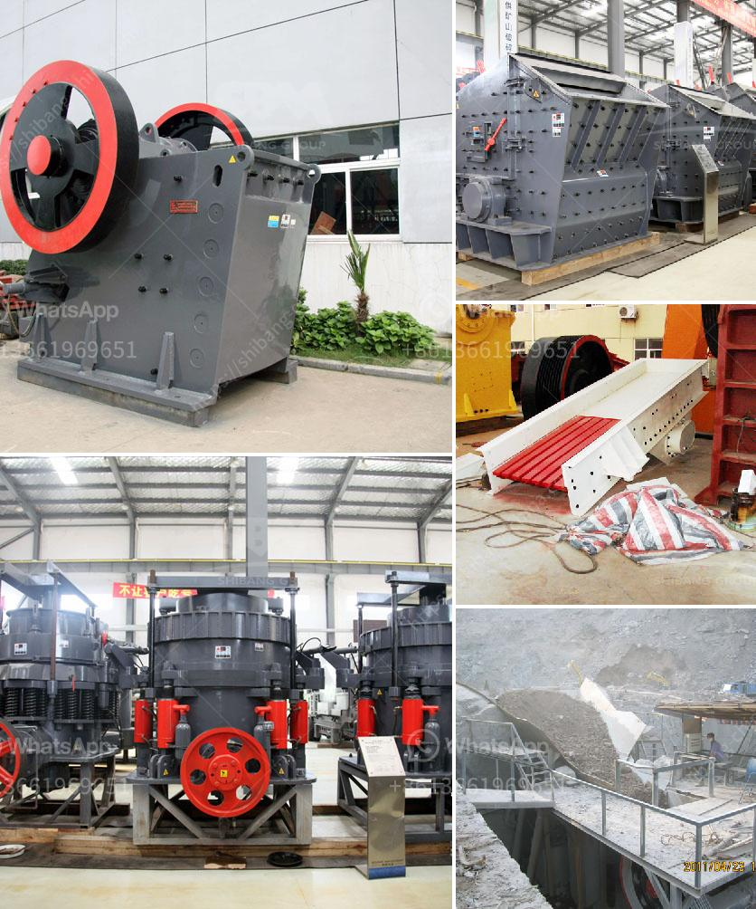

<h3>gypsum deposit in indonesia</h3>
Gypsum deposits are widely spread across Indonesia, especially on the islands of Java, Sumatra, and Kalimantan. There are also smaller deposits in Sulawesi, Bali, Lombok, and Nusa Tenggara. Indonesia's gypsum production is primarily generated as a byproduct of the extraction of natural gas, which is used in the production of plasterboards and cement.

Gypsum, also known as calcium sulfate, is a mineral that contains water molecules in its composition. It is a soft and brittle mineral usually found in sedimentary rock formations. Indonesia has an abundance of gypsum deposits due to the country's unique geological makeup, making it one of the largest producers and exporters of this mineral in the region.

The mining of gypsum in Indonesia is carried out by various methods, notably open-pit mining and underground mining. Open-pit mining is commonly used to extract gypsum near the surface, where the mineral can be easily accessed. On the other hand, underground mining is suitable for deeper deposits of gypsum, requiring a more sophisticated extraction process.

Gypsum has numerous applications across several industries, making it a valuable mineral resource. One of the primary uses of gypsum is in the construction industry. It is the main ingredient in plasterboards, which are extensively used for wall and ceiling linings in buildings. Gypsum's fire-resistant and soundproofing properties make it an ideal material for creating safer and more comfortable living and working environments.

Furthermore, gypsum is also used in the production of cement, as it helps in controlling the setting time of the concrete. By adding gypsum to the cement mixture, the rate of hardening can be regulated, allowing for a more manageable construction process. Gypsum is an essential component in the manufacturing of cement-based products such as plaster, mortar, and grout.

Aside from construction applications, gypsum is utilized in the agriculture industry as a soil amendment. Gypsum helps improve the fertility and structure of soil, enhancing its ability to retain water and nutrients. This enables farmers to achieve better crop yields and ensure sustainable agricultural practices.

Indonesia's gypsum industry plays a significant role in the country's economy. The mining and processing of gypsum provide employment opportunities and contribute to the national revenue through exports. The government has implemented regulations to ensure responsible mining practices, sustainable development, and environmental conservation. These guidelines aim to strike a balance between economic growth and environmental protection.

However, there are challenges to the sustainable exploitation of gypsum deposits in Indonesia. The excessive extraction of this mineral can lead to land degradation, water pollution, and habitat destruction. Proper mining regulations and environmental impact assessments are essential to mitigate these potential risks and ensure the long-term viability of gypsum mining in Indonesia.

In conclusion, Indonesia's gypsum deposits offer vast potential for economic growth and development. With its wide range of applications in construction, agriculture, and other industries, gypsum plays a crucial role in supporting the country's infrastructure and agricultural needs. Adhering to sustainable mining practices and environmental regulations will help ensure the responsible exploitation of this valuable mineral resource for the benefit of the Indonesian people and the environment.
<h3>Contact us</h3><ul><li><strong>Whatsapp:&nbsp;<a href="https://wa.me/8613661969651">+8613661969651</a></strong></li><li><a href="https://swt.shibang-china.com/?git&amp;zhl&amp;gypsum deposit in indonesia"><strong>Online Service(chat now)</strong></a></li></ul><h3>Related</h3><ul><li><a href='ball mills for mining of 5000 tons per hour.md'>ball mills for mining of 5000 tons per hour</a></li><li><a href='stone crushers poland.md'>stone crushers poland</a></li><li><a href='how much does a stone crusher mill.md'>how much does a stone crusher mill</a></li><li><a href='biaya conveyor belt per meter instalasi.md'>biaya conveyor belt per meter instalasi</a></li><li><a href='calcium oxide powder grinders.md'>calcium oxide powder grinders</a></li></ul>