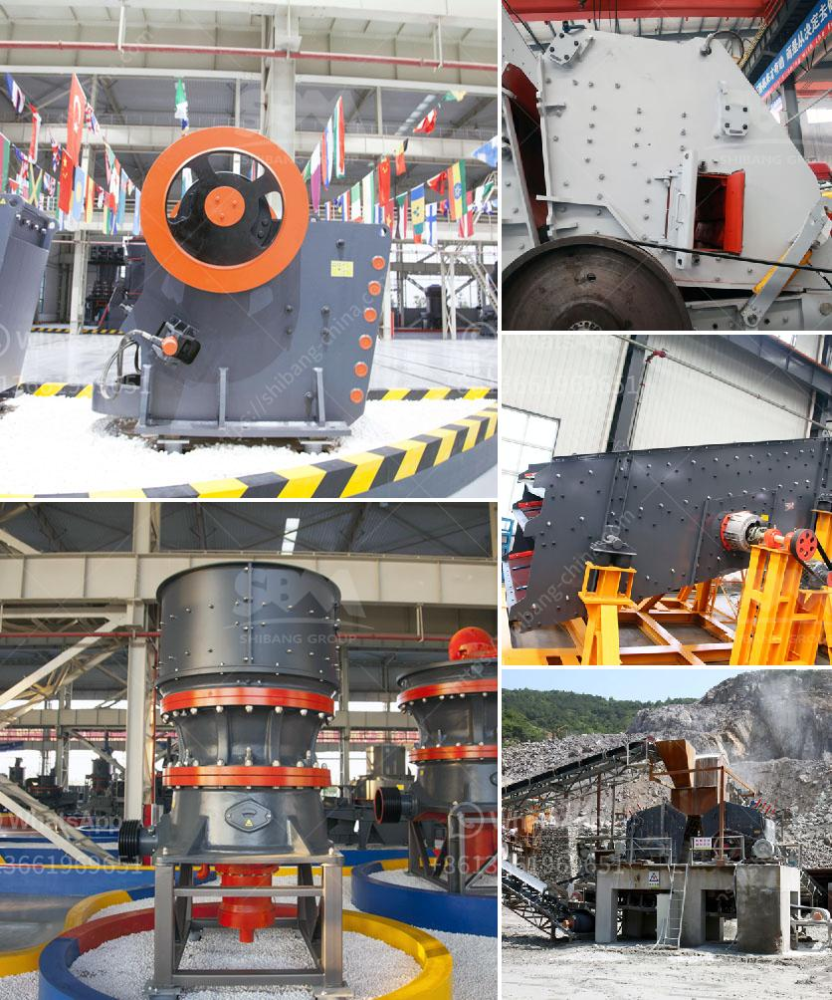

<h3>gypsum factory in ethiopia</h3>
The Ethiopian economy has been experiencing steady growth over the past decade, with various sectors contributing to its success. One rapidly emerging industry is gypsum production. Ethiopia is quickly becoming one of the leading gypsum-producing countries in Africa, attracting both local and international investors. This article explores the rise of gypsum factories in Ethiopia, the benefits they bring to the economy, and the challenges they face.

Gypsum is a mineral widely used in the construction industry as a building material. It has remarkable properties, including fire resistance, heat insulation, and soundproofing capabilities. As a result, the demand for gypsum has been steadily increasing worldwide. Recognizing these advantages, Ethiopia has harnessed its vast gypsum deposits to bolster the local construction industry and drive economic growth.

Ethiopia's government has taken significant steps to promote the gypsum industry. Through tax incentives, reduced bureaucracy, and investment-friendly policies, the government has encouraged both local and international investors to establish gypsum factories in the country. As a result, major gypsum-producing companies have set up operations in Ethiopia, driving job creation, foreign exchange earnings, and technological transfer.

One of the most significant advantages of the growing gypsum industry in Ethiopia is the creation of employment opportunities. These factories require a skilled workforce, providing jobs for engineers, technicians, and manual laborers. As the sector expands, it generates a ripple effect on other industries, such as transportation, raw material extraction, and logistics, boosting local economies and fostering development.

The gypsum factories in Ethiopia are not only catering to the local market but also exporting their products to neighboring countries and beyond. This contributes to foreign exchange earnings, which can be used to finance imports, repay loans, and develop infrastructure. The increase in exports enhances Ethiopia's profile as a competitive player in the global construction materials market.

Foreign investments in the Ethiopian gypsum industry have brought advanced technology, machinery, and expertise. This transfer of technology not only modernizes the sector but also promotes skill development among the local workforce. As employees learn to operate and maintain sophisticated machinery, they acquire valuable skills that can be utilized in other industries, further boosting the country's overall economic development.

Despite the promising growth of the gypsum industry in Ethiopia, several challenges need to be addressed. These include ensuring sustainable extraction of natural resources, improving infrastructure to facilitate transportation, and enhancing research and development capabilities to improve product quality. The government's efforts to streamline regulations, invest in infrastructure, and support research initiatives are critical to overcome these obstacles and further strengthen the industry's growth trajectory.

Ethiopia's gypsum factories have rapidly transformed into a vital sector, contributing to economic growth, employment, and foreign exchange earnings. The government's efforts to attract investments and provide a conducive business environment have spurred the industry's growth. With continued support, investment, and innovation, Ethiopia's gypsum production is well-positioned to meet increasing domestic and international demand, benefiting both the nation's economy and its people.
<h3>Contact us</h3><ul><li><strong>Whatsapp:&nbsp;<a href="https://wa.me/8613661969651">+8613661969651</a></strong></li><li><a href="https://swt.shibang-china.com/?git&amp;zhl&amp;gypsum factory in ethiopia"><strong>Online Service(chat now)</strong></a></li></ul><h3>Related</h3><ul><li><a href='dolomite ball mill price.md'>dolomite ball mill price</a></li><li><a href='used vsi crusher for sale in india.md'>used vsi crusher for sale in india</a></li><li><a href='iron ore crusher for sale.md'>iron ore crusher for sale</a></li><li><a href='crushing plant pdf.md'>crushing plant pdf</a></li><li><a href='gravel crushers for sale in manila philippines.md'>gravel crushers for sale in manila philippines</a></li></ul>