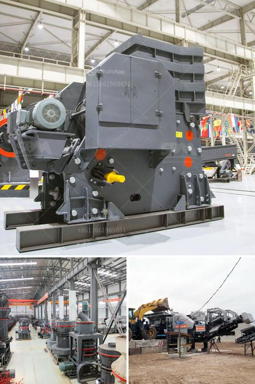

<h3>gypsum factory in pakistan</h3>
Located in the heart of South Asia, Pakistan is well-known for its rich cultural heritage and diverse landscapes. However, amongst its many hidden gems, one of the most valuable resources is the gypsum factory industry. Though often overlooked, this industry plays a vital role in supporting the nation's economy and contributing to various sectors such as construction, agriculture, and manufacturing.

Gypsum, a mineral composed of calcium sulfate dihydrate, is typically found in sedimentary rock formations. It has numerous applications due to its unique properties, making it an essential resource in various industries worldwide. Pakistan, being blessed with vast gypsum reserves, emerges as a significant player in this market, gaining recognition for its quality gypsum products.

The gypsum factory industry in Pakistan primarily flourishes in the province of Punjab, where the largest deposits of gypsum are found. This province alone contributes significantly to the overall production of gypsum in the country. The extraction and processing of gypsum involve various stages, including mining, crushing, screening, and drying, to produce gypsum powder or plaster of Paris.

One of the primary applications of gypsum is in the construction industry. Gypsum is widely used as a building material to create durable and fire-resistant walls, ceilings, and partition boards. Its non-combustible nature makes it a preferred choice as a core material in gypsum boards, ensuring safety in residential and commercial buildings. The demand for gypsum products in Pakistan's construction sector has been steadily increasing over the years, driven by urbanization and infrastructure development.

Moreover, the agricultural sector in Pakistan heavily relies on gypsum as a soil amendment. Gypsum's unique characteristics, such as its ability to improve soil structure, reduce soil erosion, and enhance water absorption, make it an essential component in improving crop yield and overall soil health. Farmers widely use gypsum to neutralize alkaline soils and improve the nutrient availability for plants, promoting sustainable agriculture practices.

In addition to construction and agriculture, gypsum finds its application in various manufacturing industries. Gypsum powder is widely used in the production of cement and as a filler material in the manufacturing of plastic products, paints, ceramics, and textiles. The versatility and abundance of gypsum in Pakistan make it an attractive choice for manufacturers, providing them with a cost-effective and eco-friendly solution.

The gypsum factory industry in Pakistan faces various challenges, including limited accessibility to modern mining and processing equipment, inadequate infrastructure, and an inconsistent supply chain. Addressing these challenges through government support and private investment is crucial to unlocking the full potential of this industry and maximizing its contribution to the national economy.

Furthermore, promoting sustainable extraction and processing practices is essential to preserve the environment and minimize the impact on natural resources. Strict regulations and effective monitoring systems must be put in place to ensure responsible mining practices and sustainable gypsum extraction in Pakistan.

In conclusion, the gypsum factory industry in Pakistan plays a vital role in supporting the nation's economy by providing essential resources for construction, agriculture, and manufacturing sectors. With its vast reserves and quality products, Pakistan has the potential to become a leading player in the global gypsum market. However, sustained investments, improved infrastructure, and responsible mining practices are necessary to unleash the full potential of this hidden gem and create a sustainable future for the industry.
<h3>Contact us</h3><ul><li><strong>Whatsapp:&nbsp;<a href="https://wa.me/8613661969651">+8613661969651</a></strong></li><li><a href="https://swt.shibang-china.com/?git&amp;zhl&amp;gypsum factory in pakistan"><strong>Online Service(chat now)</strong></a></li></ul><h3>Related</h3><ul><li><a href='clay processing technology.md'>clay processing technology</a></li><li><a href='double roll crusher china.md'>double roll crusher china</a></li><li><a href='gypsum crusher plant pdf.md'>gypsum crusher plant pdf</a></li><li><a href='crusher machine in gujranwala location.md'>crusher machine in gujranwala location</a></li><li><a href='talc powder grinding mills in german.md'>talc powder grinding mills in german</a></li></ul>