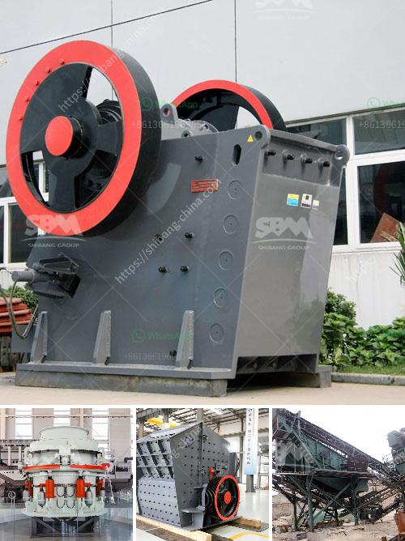

<h3>gypsum grinding machine</h3>
Gypsum is a versatile and widely used mineral in various applications. It is commonly used for making plasterboard, as a soil conditioner, and in the production of cement. Gypsum grinding machines are essential in processing gypsum into different products for various applications.

Gypsum powder is a white, smooth powder that is derived from heating gypsum stone. When gypsum is heated, it undergoes a process called calcination, where it is heated to remove any water molecules bound to it. This results in the formation of gypsum powder. The gypsum powder can then be used to make plasterboard by mixing it with water and setting the mixture.

Gypsum grinding machines provide necessary processing solutions for gypsum powder production. In the process of gypsum powder production, many different types of grinding mills are needed. Compared with traditional grinding mills, gypsum grinding machines have higher efficiency and more stable operation.

Gypsum grinding machines can be divided into vertical grinding mills, ultrafine grinding mills, trapezoidal grinding mills, and medium-speed grinding mills. According to the different needs of gypsum powder fineness, the gypsum grinding machine can be different. For example, the common gypsum grinding machines include Raymond mill, ball mill, and European grinding mill.

Gypsum grinding machines also have various functions and applications. The specific process for grinding gypsum depends on the purpose of the finished product. For example, the gypsum grinding machine for making plasterboard requires a different type of grinding process than the one for producing cement.

In conclusion, gypsum grinding machines are essential in the processing of gypsum into different products for various applications. These machines offer higher efficiency and stable operation compared to traditional grinding mills. The specific type of gypsum grinding machine depends on the desired fineness of the gypsum powder and the purpose of its use.
<h3>Contact us</h3><ul><li><strong>Whatsapp:&nbsp;<a href="https://wa.me/8613661969651">+8613661969651</a></strong></li><li><a href="https://swt.shibang-china.com/?git&amp;zhl&amp;gypsum grinding machine"><strong>Online Service(chat now)</strong></a></li></ul><h3>Related</h3><ul><li><a href='limestone ball rod mill.md'>limestone ball rod mill</a></li><li><a href='jual ball mill second.md'>jual ball mill second</a></li><li><a href='setting up a quarry in nigeria.md'>setting up a quarry in nigeria</a></li><li><a href='bauxite processing plant kenya.md'>bauxite processing plant kenya</a></li><li><a href='industrial application of ball mills.md'>industrial application of ball mills</a></li></ul>