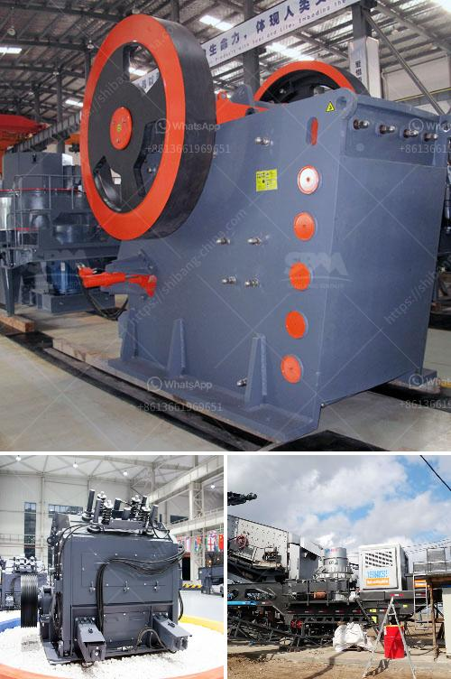

<h3>gypsum import from bhutan</h3>
Gypsum is a mineral commonly found in sedimentary rocks. It is widely used in various industries, including construction, agriculture, and manufacturing. One of the countries that has emerged as a major supplier of gypsum is Bhutan, a small landlocked nation located in the eastern Himalayas.

Bhutan has vast reserves of high-quality gypsum, which makes it an attractive source for importers worldwide. Due to its geographical location, Bhutan enjoys lower transportation costs compared to other gypsum-producing countries, making it a cost-effective option for importers.

The high purity of Bhutanese gypsum is another reason why it is preferred by many industries. This mineral is crucial in the production of gypsum boards, cement, and plaster of Paris, as it provides strength and durability to these materials. Additionally, gypsum is also used in agriculture as a soil conditioner and nutrient source, promoting healthy plant growth.

Gypsum import from Bhutan has witnessed a steady increase in recent years, with several countries recognizing the advantages of sourcing gypsum from this unique destination. India, being the largest importer of gypsum globally, heavily relies on Bhutan to meet its gypsum requirements. The accessibility and high purity of Bhutanese gypsum make it a preferred choice for Indian manufacturers, especially the construction industry, which contributes significantly to the country's GDP.

Apart from India, other countries such as Bangladesh, Nepal, and the Middle Eastern nations also rely on Bhutan for their gypsum needs. This has not only boosted Bhutan's economy but has also established the nation as a reliable supplier of gypsum worldwide.

However, it is essential to ensure sustainable mining practices to avoid depleting gypsum reserves in Bhutan. The government of Bhutan has proactively taken measures to regulate the mining industry and enforce strict environmental standards. This ensures that mining activities are carried out responsibly, minimizing the negative impact on the environment and local communities.

In conclusion, the gypsum import from Bhutan has gained momentum in recent years due to the country's abundant reserves of high-quality gypsum. Bhutan's geographical advantage, coupled with the purity of its gypsum, makes it an attractive source for various industries. With responsible mining practices in place, Bhutan is poised to continue being a reliable supplier of this essential mineral, contributing to the growth of economies worldwide.
<h3>Contact us</h3><ul><li><strong>Whatsapp:&nbsp;<a href="https://wa.me/8613661969651">+8613661969651</a></strong></li><li><a href="https://swt.shibang-china.com/?git&amp;zhl&amp;gypsum import from bhutan"><strong>Online Service(chat now)</strong></a></li></ul><h3>Related</h3><ul><li><a href='jaw crusher specification for lime limestone.md'>jaw crusher specification for lime limestone</a></li><li><a href='feldspar grinding mill suppliers india.md'>feldspar grinding mill suppliers india</a></li><li><a href='ball mill ghana in zambia.md'>ball mill ghana in zambia</a></li><li><a href='secondary jaw crusher.md'>secondary jaw crusher</a></li><li><a href='barite machinery production plant.md'>barite machinery production plant</a></li></ul>