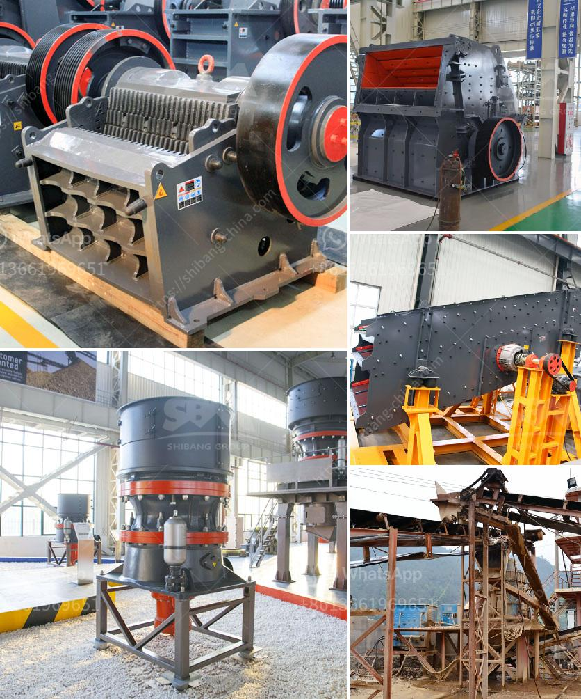

<h3>gypsum machine 100ton price in india</h3>
Gypsum Machine 100 Ton Price in India: The Growing Construction Industry and the Demand for Gypsum-Based Products

India is witnessing rapid growth in its construction industry. With the government's focus on infrastructure development and initiatives like "Housing for All," there has been a significant increase in the demand for construction materials. Gypsum, a versatile building material, has emerged as a popular choice due to its numerous applications and environmental benefits. As the market demand for gypsum-based products continues to rise, the need for efficient gypsum machines has become crucial for construction companies. In this article, we will explore the gypsum machine's 100-ton price in India and its significance in the growing construction industry.

Gypsum, a mineral composed of calcium sulfate dihydrate, is widely used in the construction industry for its fire-resistant and soundproofing properties. It finds its application in plasters, wallboards, cement, and even as a fertilizer. Due to its versatility, the demand for gypsum-based products has been steadily increasing. To cater to this demand, it is essential to have advanced machinery and equipment that can efficiently produce gypsum-based products.

The gypsum machine, capable of producing up to 100 tons of high-quality gypsum products per hour, plays a crucial role in meeting this growing demand. These machines are designed to automate the entire process, from the initial raw material intake to the final product packaging. With precise control systems, the machines ensure consistent product quality and minimize human errors, making them highly efficient and reliable.

The price of a gypsum machine depends on various factors such as the capacity, technology, and brand. On average, a gypsum machine capable of producing 100 tons per hour can cost between INR 1,50,00,000 to INR 2,50,00,000. However, it is important to note that these prices are approximate and can vary depending on the specific requirements and specifications of the machine.

Despite the initial investment, the benefits of using a gypsum machine are numerous. Firstly, the automation of the production process saves labor costs and ensures higher productivity. The machines are designed to minimize wastage, making the production process more cost-effective. Additionally, the consistent quality of the gypsum products produced by these machines enhances customer satisfaction and increases the overall profitability. Therefore, the long-term financial benefits of investing in a gypsum machine often outweigh the initial costs.

Furthermore, the use of gypsum-based products offers several environmental advantages. Gypsum is a naturally occurring mineral, and its mining has a minimal impact on the environment compared to other construction materials. Gypsum-based products also contribute to energy conservation by improving thermal insulation in buildings. As India strives to become more sustainable and environmentally conscious, the demand for gypsum-based products is expected to further increase.

In conclusion, as India's construction industry continues to witness rapid growth, the demand for gypsum-based products is rising. To meet this demand, investing in a gypsum machine with a capacity of 100 tons per hour can significantly increase productivity, improve product quality, and reduce labor costs. While the initial investment may seem substantial, the long-term benefits and environmental advantages make it a viable proposition. As the construction industry embraces sustainable practices and innovative materials, gypsum-based products are likely to play a vital role, driving the demand for machines that can efficiently produce them.
<h3>Contact us</h3><ul><li><strong>Whatsapp:&nbsp;<a href="https://wa.me/8613661969651">+8613661969651</a></strong></li><li><a href="https://swt.shibang-china.com/?git&amp;zhl&amp;gypsum machine 100ton price in india"><strong>Online Service(chat now)</strong></a></li></ul><h3>Related</h3><ul><li><a href='stone crusher machine for sale in kenya.md'>stone crusher machine for sale in kenya</a></li><li><a href='copper ore machine in china.md'>copper ore machine in china</a></li><li><a href='limestone plant machinery manufacturers sale tamilnadu.md'>limestone plant machinery manufacturers sale tamilnadu</a></li><li><a href='working principle of conveyor belt.md'>working principle of conveyor belt</a></li><li><a href='rock stone milling machine.md'>rock stone milling machine</a></li></ul>