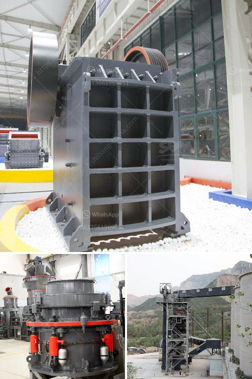

<h3>gypsum machine in germany</h3>
Germany has been at the forefront of technology advancement for many decades. From cars to machinery, their innovative approach has made them a global leader in various industries. One such industry where Germany has showcased its prowess is in the production of gypsum machines.

Gypsum, a mineral widely used in construction and building materials, requires advanced machinery for its processing and production. The German gypsum machine manufacturers have invested heavily in R&D, resulting in world-class equipment that has set new standards in the industry.

Gypsum is a soft, sulfate mineral, composed of calcium sulfate dihydrate. It is widely used as a fertilizer, in the manufacturing of cement, and as a component in various building materials. To efficiently produce gypsum products, the ore must be finely ground and dried before being mixed with water to form a slurry.

The German gypsum machines are designed to efficiently grind the ore and dry it to a specific moisture content. This ensures the final product is of high quality, with consistent properties. These machines have advanced controls and sensors that monitor and regulate the entire process, ensuring minimal human intervention and maximum efficiency.

One of the key features of German gypsum machines is their ability to produce a wide range of gypsum products. These machines can produce gypsum boards, gypsum plaster, gypsum cornice, and various other gypsum-based products used in construction. The flexibility of these machines allows manufacturers to cater to different market needs and produce high-quality products to meet customer requirements.

In addition to their versatility, German gypsum machines also focus on energy efficiency and sustainability. They are designed to consume less energy while maximizing output. This helps reduce the ecological impact of gypsum production and contributes to a greener environment.

Furthermore, German gypsum machines are known for their exceptional reliability and durability. These machines are built using high-quality materials and undergo rigorous testing to ensure they can withstand the demands of the production process. Manufacturers can rely on these machines to operate smoothly, minimizing downtime and maximizing productivity.

The German gypsum machine manufacturers also provide excellent after-sales support, including maintenance services and spare parts availability. This ensures that manufacturers can rely on their machinery for uninterrupted production and timely delivery of gypsum products.

Germany's expertise in the field of gypsum machines is recognized globally. The German manufacturers export their machinery to various countries, where they are highly regarded for their quality and efficiency. This has helped boost Germany's economy and strengthen its position as a global leader in manufacturing and technology.

In conclusion, the gypsum machines produced in Germany are a technological marvel. They showcase the country's commitment to innovation, energy efficiency, and sustainability. These machines enable manufacturers to produce high-quality gypsum products while minimizing environmental impact. With their exceptional reliability and versatility, the German gypsum machines set new industry standards and contribute significantly to the construction sector worldwide.
<h3>Contact us</h3><ul><li><strong>Whatsapp:&nbsp;<a href="https://wa.me/8613661969651">+8613661969651</a></strong></li><li><a href="https://swt.shibang-china.com/?git&amp;zhl&amp;gypsum machine in germany"><strong>Online Service(chat now)</strong></a></li></ul><h3>Related</h3><ul><li><a href='graphite processing machine.md'>graphite processing machine</a></li><li><a href='rock crusher plant for sale.md'>rock crusher plant for sale</a></li><li><a href='barite beneficiation plant manufacturers in usa.md'>barite beneficiation plant manufacturers in usa</a></li><li><a href='how much investment needed to start a crusher in canada.md'>how much investment needed to start a crusher in canada</a></li><li><a href='sand washing plant for sale in south africa.md'>sand washing plant for sale in south africa</a></li></ul>