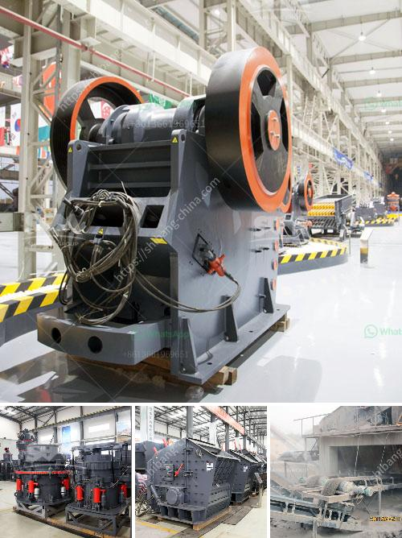

<h3>gypsum making machinery</h3>
Gypsum is a versatile material used in various industries for different applications. From construction to agriculture, gypsum has proven to be quite useful due to its unique properties. To efficiently produce gypsum products, manufacturers rely on gypsum making machinery.

Gypsum making machinery refers to the equipment used to process gypsum powder into a variety of gypsum products. Typically, gypsum raw material is mined and sorted into lumps and fines. The lumps are crushed and then ground into powder, which is further dried and then compacted into different forms, such as bricks or panels, using specialized machinery.

One of the essential components of gypsum making machinery is the crusher. This machine is responsible for reducing the size of the gypsum raw material to facilitate processing. The crusher breaks down large chunks of gypsum into smaller pieces, making it easier to handle and grind. There are different types of crushers available, such as jaw crushers, impact crushers, or hammer mills, depending on the desired output size and processing requirements.

After crushing, the gypsum powder undergoes a drying process to eliminate any excess moisture. Excessive moisture can affect the final product quality and lead to decreased strength and durability. Specialized gypsum drying equipment is used to remove the moisture from the gypsum powder, ensuring that the final product meets the desired specifications.

The next step in the gypsum making process is to compact the dried gypsum powder into various forms. This is achieved using machinery such as presses or extruders. Presses apply a significant amount of pressure to compact the gypsum powder into solid blocks or bricks, while extruders force the powder through a shaped die to produce specific profiles, such as panels or tiles.

To enhance the properties of the final gypsum products, additives can be incorporated during the manufacturing process. Common additives include retarders, accelerators, and water reducers. These additives help control the setting time, improve workability, and enhance the final product's strength and resistance.

Gypsum making machinery also includes equipment for surface finishing and decoration. Gypsum products can be finished with different textures, patterns, or coatings to achieve the desired aesthetic appeal. Machinery like rollers, presses, or engravers are used to create intricate designs or textures on the gypsum surface.

In conclusion, gypsum making machinery plays a crucial role in the efficient production of gypsum products. From crushing and drying to compacting and surface finishing, these machines enable manufacturers to create high-quality gypsum-based materials for various industries. The use of specialized machinery ensures that the processing steps are carried out accurately, leading to consistent and reliable production. As technology continues to advance, gypsum making machinery is expected to become even more advanced, enabling manufacturers to produce innovative and sustainable gypsum products for the future.
<h3>Contact us</h3><ul><li><strong>Whatsapp:&nbsp;<a href="https://wa.me/8613661969651">+8613661969651</a></strong></li><li><a href="https://swt.shibang-china.com/?git&amp;zhl&amp;gypsum making machinery"><strong>Online Service(chat now)</strong></a></li></ul><h3>Related</h3><ul><li><a href='kaolin crusher manufacturers in uk.md'>kaolin crusher manufacturers in uk</a></li><li><a href='usa used equipment grinding mill 100tph 200 mesh.md'>usa used equipment grinding mill 100tph 200 mesh</a></li><li><a href='raymond mills mumbai philippines.md'>raymond mills mumbai philippines</a></li><li><a href='gypsum machine 100ton price in india.md'>gypsum machine 100ton price in india</a></li><li><a href='rock quarry equipment.md'>rock quarry equipment</a></li></ul>