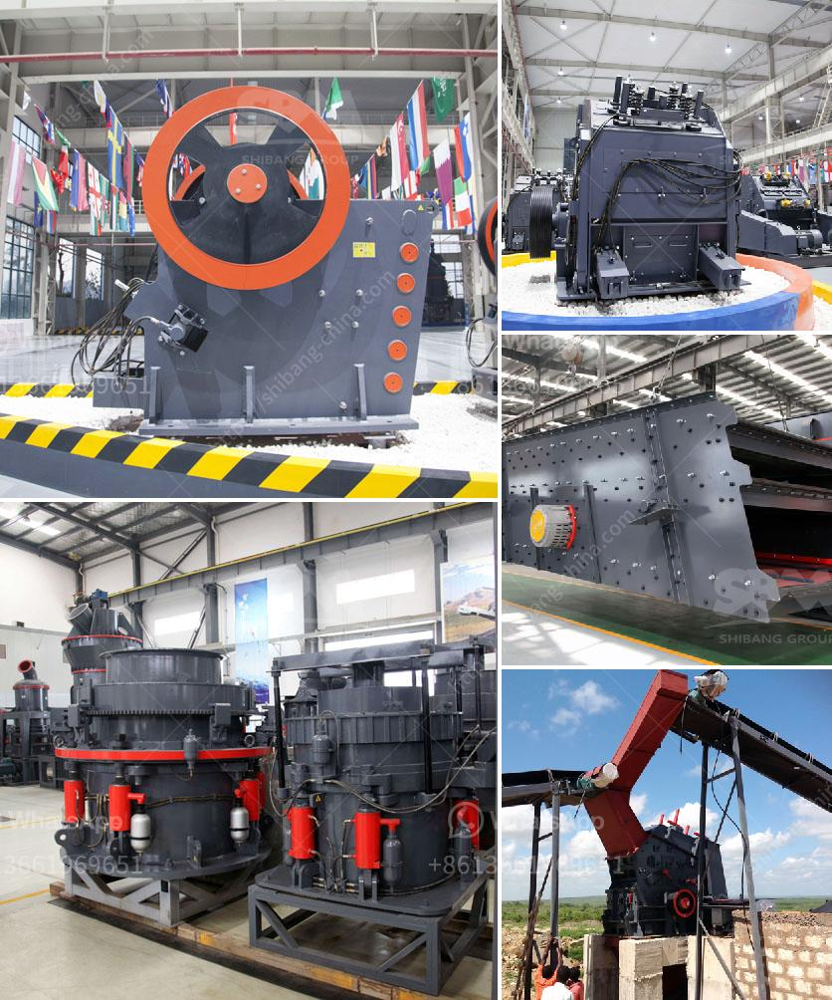

<h3>gypsum mining plant</h3>
Gypsum is a mineral that is commonly used in the construction industry, whether as a building material, ingredient in cement, or as a soil conditioner. It is a versatile mineral with a wide range of uses, and its importance in various industries cannot be understated. The process of extracting gypsum from the ground is known as gypsum mining, and it involves the use of heavy machinery.

A gypsum mining plant is often a complex and demanding operation that requires a lot of investment. Its success depends on various factors like the quality of the ore, its processing capacity, the technology used, and the expertise of the operators. Generally, a facility that produces high-quality gypsum with efficient processing methods will be more profitable.

Gypsum mining plants typically consist of equipment such as crushers, screens, and conveyors used to break the gypsum into smaller pieces and transport it to further processing operations. Additionally, specialized equipment such as rotary dryers, calciners, and gypsum mills may be utilized to transform the raw material into marketable products.

Moreover, environmental considerations are paramount in gypsum mining operations. Adequate measures must be implemented to minimize dust, noise, and water pollution. Proper land reclamation techniques should also be applied to restore the mined areas to their natural state or repurpose them for other uses, such as agriculture or recreational purposes.

A well-run gypsum mining plant can be a significant economic contributor to a region, providing employment opportunities and supporting local businesses. Moreover, it can contribute to the development and growth of related industries such as construction and agriculture, which depend on gypsum for their operations.

In conclusion, gypsum mining plants play a vital role in providing the necessary raw material for various industries. The success of such plants relies on factors such as efficient processing methods, investment in technology, and adherence to environmental regulations. A well-managed gypsum mining plant can yield substantial economic benefits while ensuring environmental sustainability.
<h3>Contact us</h3><ul><li><strong>Whatsapp:&nbsp;<a href="https://wa.me/8613661969651">+8613661969651</a></strong></li><li><a href="https://swt.shibang-china.com/?git&amp;zhl&amp;gypsum mining plant"><strong>Online Service(chat now)</strong></a></li></ul><h3>Related</h3><ul><li><a href='iron ore beneficiation plant.md'>iron ore beneficiation plant</a></li><li><a href='ball mill manufacturer in bhayander.md'>ball mill manufacturer in bhayander</a></li><li><a href='belt conveyor indonesia.md'>belt conveyor indonesia</a></li><li><a href='simple grinding mill type in ethiopia.md'>simple grinding mill type in ethiopia</a></li><li><a href='rock quarry sizing process.md'>rock quarry sizing process</a></li></ul>