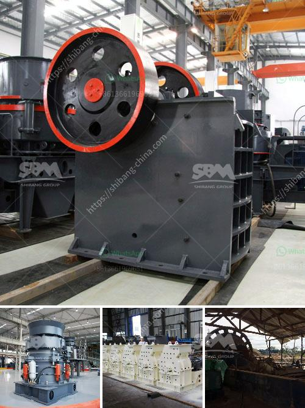

<h3>gypsum plasterboard manufacturing process</h3>
Gypsum plasterboard, commonly known as drywall or sheetrock, is a widely used construction material. It is primarily made of gypsum plaster sandwiched between two layers of paper. The manufacturing process of gypsum plasterboard involves several stages, from raw material preparation to final product packaging. Let's explore this process in detail.

The first step in gypsum plasterboard manufacturing is mining gypsum, a naturally occurring mineral. This mineral is then crushed into a fine powder using specialized equipment. High-quality gypsum is essential for the production of a strong and durable plasterboard.

Next, the powdered gypsum is mixed with water to create a slurry. This slurry is fed into a forming machine that spreads it evenly onto a moving sheet of paper. Another sheet of paper is then placed on top, forming a sandwich with the gypsum slurry in between. The sheets of paper used are typically made of recycled materials, making gypsum plasterboard an environmentally friendly choice.

Once the gypsum slurry is sandwiched between the paper layers, the continuous board moves into a drying chamber. In this chamber, a set of rollers compress the layers together, squeezing out excess water. The board is then heated to evaporate any remaining moisture, resulting in a solid and stable plasterboard.

After the drying process, the plasterboard is cut into desired lengths using automated cutting machinery. The cut boards are then trimmed to achieve precise dimensions and to remove any imperfections. The edges of the boards are also beveled to allow for easier jointing during installation.

The next stage involves the application of protective lining to the plasterboard. This lining helps to improve the overall durability and fire resistance of the boards. The lining material, typically made of glass fibers, is applied to the surface of the boards. It is then cured using heat or a chemical process, resulting in a strong and durable protective layer.

Once the plasterboard is lined, it undergoes a final quality control inspection. Any defective boards are removed from the production line to ensure only high-quality products reach the market.

After passing the quality control inspection, the plasterboard is ready for packaging. It is stacked, wrapped, and labeled for shipment to customers. The packaging process ensures that the boards remain protected during transportation and storage.

In conclusion, the manufacturing process of gypsum plasterboard involves various stages, starting from mining gypsum to packaging the final product. Each step requires careful attention to ensure that the plasterboard is of high quality, durable, and meets the necessary standards. Gypsum plasterboard continues to be a popular choice in the construction industry due to its versatility, ease of installation, and fire-resistant properties.
<h3>Contact us</h3><ul><li><strong>Whatsapp:&nbsp;<a href="https://wa.me/8613661969651">+8613661969651</a></strong></li><li><a href="https://swt.shibang-china.com/?git&amp;zhl&amp;gypsum plasterboard manufacturing process"><strong>Online Service(chat now)</strong></a></li></ul><h3>Related</h3><ul><li><a href='iron separator from steel slag.md'>iron separator from steel slag</a></li><li><a href='gypsum powder machine.md'>gypsum powder machine</a></li><li><a href='best machine brands for quarry.md'>best machine brands for quarry</a></li><li><a href='raymond grinder mill pakistan.md'>raymond grinder mill pakistan</a></li><li><a href='coal crusher 350tph.md'>coal crusher 350tph</a></li></ul>