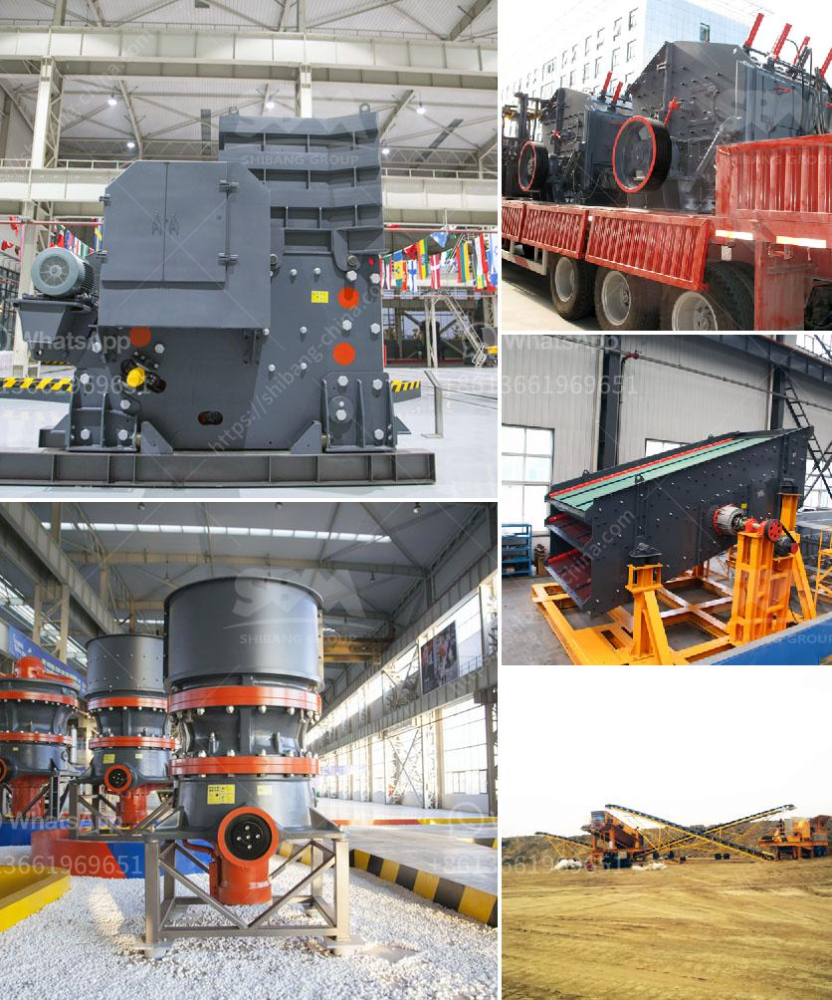

<h3>gypsum powder machine</h3>
Gypsum powder machine plays a significant role in the production of gypsum powder, which is widely used in various industries. Gypsum powder is widely used in industries like construction, agriculture, and pharmaceuticals, making it an essential raw material for many applications.

The gypsum powder machine is designed to grind the large gypsum ores into smaller particles or powder size. It is often used for the preliminary grinding process, which can reduce the raw materials' size before further processing. The machine is equipped with high-speed rotating hammers that crush the gypsum ore into fine particles.

One of the distinct features of the gypsum powder machine is its ability to produce a well-defined powder size. The machine comes with different sieve sizes, allowing users to adjust the powder's fineness as per their requirements. This flexibility makes it suitable for a wide range of applications, from plasterboard production to soil amendment.

Furthermore, the gypsum powder machine is designed for high productivity and efficiency. The machine utilizes advanced techniques, such as air classification and particle size control, to ensure a consistent and high-quality powder output. It is also equipped with a dust collection system, reducing the environmental impact of the production process.

The maintenance and operation of the gypsum powder machine are relatively straightforward. The machine's design includes easy access to its components, making it convenient for cleaning and maintenance purposes. Additionally, the machine is equipped with safety features to ensure the operator's protection during operation.

In conclusion, the gypsum powder machine plays a crucial role in the production of high-quality gypsum powder. Its ability to produce well-defined powder size, high productivity, and efficiency make it a valuable tool in various industries. With its user-friendly design and easy maintenance, it is a reliable machine for gypsum powder production.
<h3>Contact us</h3><ul><li><strong>Whatsapp:&nbsp;<a href="https://wa.me/8613661969651">+8613661969651</a></strong></li><li><a href="https://swt.shibang-china.com/?git&amp;zhl&amp;gypsum powder machine"><strong>Online Service(chat now)</strong></a></li></ul><h3>Related</h3><ul><li><a href='coal preparation plant cost.md'>coal preparation plant cost</a></li><li><a href='mini cement plant project in india.md'>mini cement plant project in india</a></li><li><a href='ball mills for mining in china.md'>ball mills for mining in china</a></li><li><a href='belt and conveyor distributor in indonesia.md'>belt and conveyor distributor in indonesia</a></li><li><a href='nigeria stone crusher.md'>nigeria stone crusher</a></li></ul>