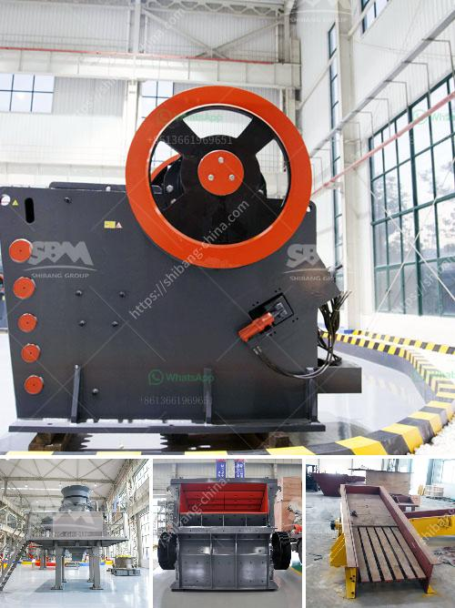

<h3>gypsum powder processing plant cost</h3>
Gypsum powder has been widely used in various industries such as construction, agriculture, and chemical. With the increasing demands of gypsum powder, the production process has become more and more important. As a professional manufacturer of mining equipment, Clirik can offer all mining machines involved in the production process of gypsum powder.

In a gypsum powder processing plant, some mining machines are necessary, such as gypsum crusher, gypsum grinding mill, vibrating screen, gypsum vibrating feeder, and conveyors. In the gypsum mining process, the gypsum crusher is used to crush the large gypsum ore into small particles. When the size of the gypsum ore is smaller than 30mm, jaw crusher is the most suitable crusher.

The crushed gypsum will be sent to the gypsum grinding mill for further grinding through the vibrating feeder. The ground gypsum powder is blown out by the airflow of the blower, and is classified by an analyzer above the grinding chamber of the mill. The qualified gypsum powder particles are collected by the cyclone collector and discharged through the powder outlet pipe. On the other hand, the unqualified gypsum powder is sent back to the mill for re-grinding until it reaches the desired fineness.

The cost of a gypsum powder processing plant depends on its capacity, customer requirements, and manufacturing process. The larger the capacity, the higher the price. It features high capacity, low consumption, easy operation, and maintenance, and low final product cost. The finished product fineness can be adjusted between 325-2500 meshes, and the maximum processing capacity can reach 100 tons per hour.

In conclusion, the cost of a gypsum powder processing plant can vary depending on the specific requirements and processing capacity. It is important to choose a reliable and experienced manufacturer to ensure the quality and efficiency of the plant. Clirik, with its rich experience in gypsum powder processing, can provide customized solutions and high-quality equipment for various customers.
<h3>Contact us</h3><ul><li><strong>Whatsapp:&nbsp;<a href="https://wa.me/8613661969651">+8613661969651</a></strong></li><li><a href="https://swt.shibang-china.com/?git&amp;zhl&amp;gypsum powder processing plant cost"><strong>Online Service(chat now)</strong></a></li></ul><h3>Related</h3><ul><li><a href='marble crushing line.md'>marble crushing line</a></li><li><a href='mtm grinding mill.md'>mtm grinding mill</a></li><li><a href='used iron ore jaw crusher price nigeria.md'>used iron ore jaw crusher price nigeria</a></li><li><a href='gypsum factory in pakistan.md'>gypsum factory in pakistan</a></li><li><a href='grinding ball mill equipment.md'>grinding ball mill equipment</a></li></ul>