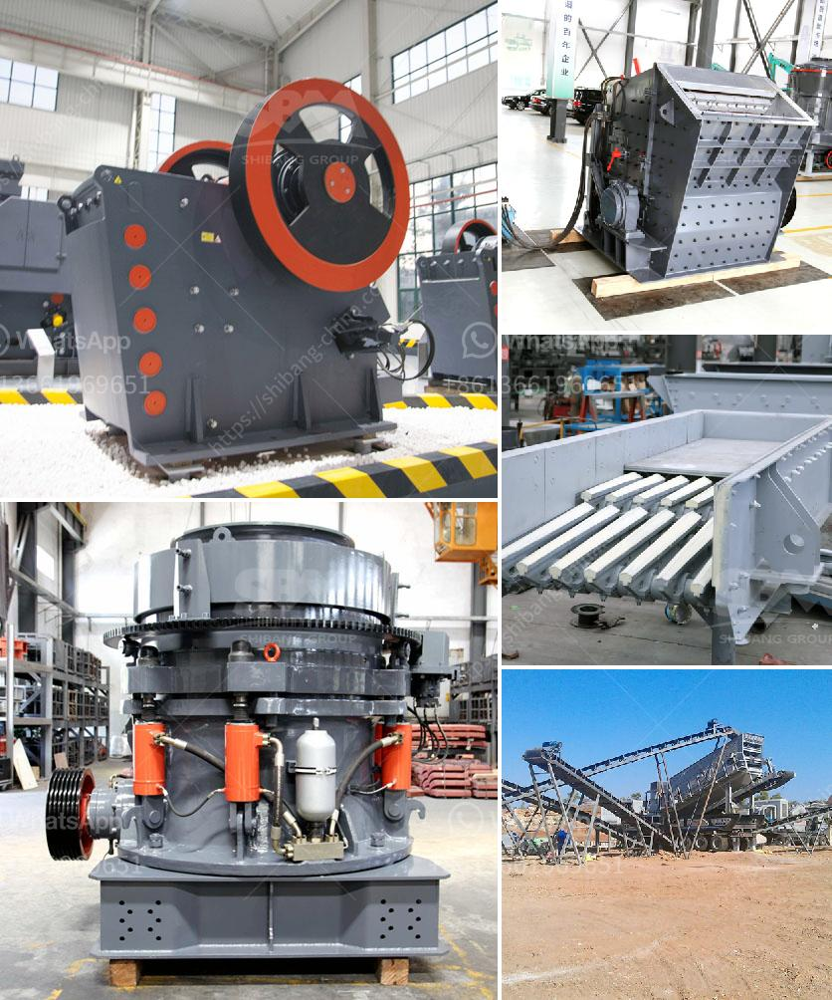

<h3>gypsum powder production equipment price</h3>
Gypsum powder has been widely used in many fields. In recent years, the demand for gypsum powder has increased due to the construction boom. Therefore, the price of gypsum powder has become an important topic in the gypsum powder production industry.

As a professional manufacturer of mining equipment, Clirik has been deeply involved in the gypsum powder industry for many years. Clirik has strong strength, advanced technology, and high-quality equipment. The gypsum powder production equipment produced by Clirik has reliable performance and stable operation, which has won the favor of many customers.

The price of gypsum powder production equipment mainly includes three aspects: configuration, equipment quality, and after-sales service.

1. Configuration: The configuration of gypsum powder production equipment is an important factor affecting its price. Different configurations will have different functions and output. Generally speaking, the more advanced the configuration, the higher the price. Customers can choose the appropriate configuration according to their actual production needs.

2. Equipment quality: The quality of gypsum powder production equipment directly affects its service life, production efficiency, and operation stability. Equipment with good quality uses high-quality materials and advanced production technology. Although the price of high-quality equipment may be higher, it can bring higher economic benefits to customers in the long run.

3. After-sales service: After-sales service is an important part of the price of gypsum powder production equipment. Good after-sales service can effectively solve various problems encountered by customers during the use of equipment. Clirik has a perfect after-sales service system, providing customers with installation, commissioning, and technical guidance services, which can greatly reduce the worries of customers.

In addition to the above factors, the price of gypsum powder production equipment is also affected by market competition and raw material prices. In recent years, with the increasing demand for gypsum powder, the price of gypsum powder production equipment has shown an overall upward trend. However, under the premise of ensuring quality, Clirik has been striving to provide customers with more affordable prices.

In conclusion, the price of gypsum powder production equipment is affected by various factors such as configuration, equipment quality, and after-sales service. Customers should choose equipment with reasonable configuration and good quality, and pay attention to after-sales service when purchasing equipment. Customers can compare multiple manufacturers and choose a reliable supplier with good reputation and comprehensive strength to ensure the quality and price of gypsum powder production equipment.
<h3>Contact us</h3><ul><li><strong>Whatsapp:&nbsp;<a href="https://wa.me/8613661969651">+8613661969651</a></strong></li><li><a href="https://swt.shibang-china.com/?git&amp;zhl&amp;gypsum powder production equipment price"><strong>Online Service(chat now)</strong></a></li></ul><h3>Related</h3><ul><li><a href='bauxite processing plant kenya.md'>bauxite processing plant kenya</a></li><li><a href='project proposal on funding gold mining.md'>project proposal on funding gold mining</a></li><li><a href='manufacturer of ball mill companies indonesia.md'>manufacturer of ball mill companies indonesia</a></li><li><a href='iron processing equipment cost.md'>iron processing equipment cost</a></li><li><a href='second hand concrete grinding machine supplier in dubai.md'>second hand concrete grinding machine supplier in dubai</a></li></ul>