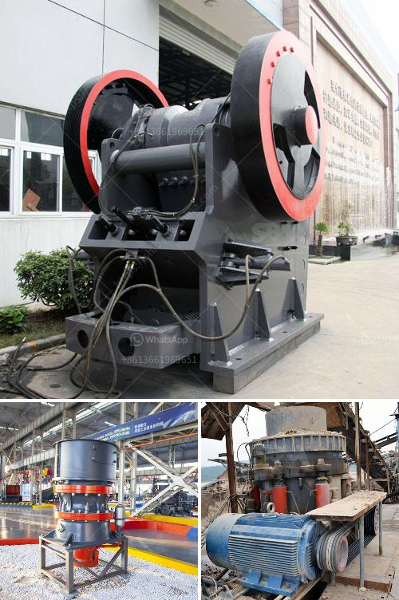

<h3>gypsum powder production line manufacturers germany</h3>
Gypsum powder production line has been booming in Germany. For many years, Germany has been one of the largest gypsum powder production line market makers and consumers in the world. With the increase of environmental protection consciousness and the improvement of gypsum powder production technology, the current market demand for gypsum powder is focused on quality and environmental protection. Therefore, the German gypsum powder production line manufacturers are the key to improving the quality of gypsum powder.

Gypsum powder production line crushing mill system. Chunks of plaster evenly through the conveyor into jaw crusher for primary crushing, homogenizing the zoning arrangement of the discharge field, and then by crushing crusher for secondary crushing, into the hopper. The material continues to be finely crushed and ground in the gypsum powder production line mill. After grinding, the powder is separated by the classifier through the airflow of the part above the collector. The vertical roller mill adopts the method of roller grinding materials, which has better matching effect and can produce more orderly fine powder.

Germany gypsum powder production line for sale. The German gypsum powder production line adopts simens PLC control system. The mature production line can provide the greatest value. The gypsum powder produced in the market must be suitable for the market demand or the production of building materials. It is difficult to predict the specific requirements for the gypsum powder. In terms of technology, there is no fixed standard specification to be followed. Gypsum powder production line is a natural mineral gypsum (gypsum) or industrial by-product gypsum (gypsum, phosphogypsum, etc.) After a certain heating temperature calcining and grinding to make gypsum dehydration decomposition, resulting in β hemihydrate gypsum ( CaSO4 • 1 / 2H2O) as the main component of the product, that is, building gypsum (through the plaster).

Gypsum Powder Production Line Manufacturers In the production of gypsum powder, grinding is the key link, is also the most difficult to master part. According to this situation, we according to the continuous exploration and research of the gypsum powder production and deep processing industry for many years, has developed a new generation of cement packing machine, cement packing machine. The cement packaging machine is mainly composed of four parts: automatic weighing device, conveying device, sewing device and computer control system. Its characteristic is: the cement packaging machine can automatically complete the whole process of bagging, metering, burdening, identification. The material of the bag is woven bag or spezialpapierg these accounts with special moistureproof, waterproof and other effect, suitable for a variety of climate zone, warehouse storage of cement, limestone, coal, gypsum and other powder material coal, gypsum and other powder material.

In summary, the German gypsum powder production line manufacturer plays a key role in the overall plan of the gypsum powder production line in Germany. The milling process is the core to ensure the quality of the final gypsum powder. It is reported that the European gypsum powder production line needs to consume at least 3 tons of materials for producing 1 ton of gypsum powder. The gypsum powder processing requires drying, grinding and calcining processes in the production process. The main equipment used in the process are jaw crusher, ball mill, vibrating screen, and air classifier. On the basis of these equipments, there are also driving device, dust collector, electric control device, feeding valve and so on. The vertical roller mill of HCMilling(Guilin Hongcheng) can be used to grind the gypsum powder with a production capacity of 10-45 tons per hour. It is the ideal gypsum grinding mill for gypsum powder production.
<h3>Contact us</h3><ul><li><strong>Whatsapp:&nbsp;<a href="https://wa.me/8613661969651">+8613661969651</a></strong></li><li><a href="https://swt.shibang-china.com/?git&amp;zhl&amp;gypsum powder production line manufacturers germany"><strong>Online Service(chat now)</strong></a></li></ul><h3>Related</h3><ul><li><a href='rock breaker machine in south africa.md'>rock breaker machine in south africa</a></li><li><a href='sand washing plants in india.md'>sand washing plants in india</a></li><li><a href='barite beneficiation plant manufacturers in usa.md'>barite beneficiation plant manufacturers in usa</a></li><li><a href='suplier sand making machine from philippines.md'>suplier sand making machine from philippines</a></li><li><a href='dolomite crushing machine mill.md'>dolomite crushing machine mill</a></li></ul>