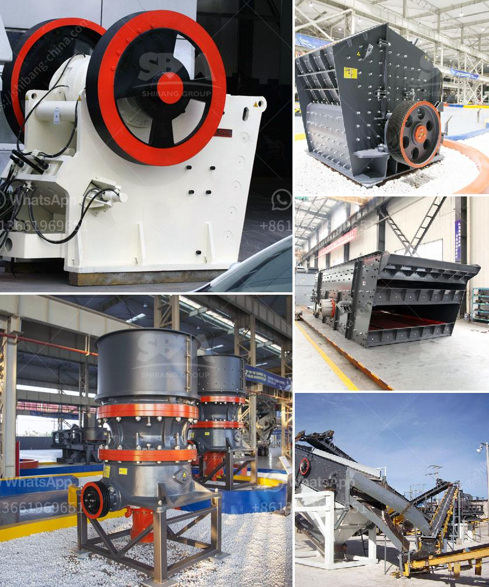

<h3>gypsum processing crusher</h3>
Gypsum is a widely used industrial material and building material. Gypsum (CaSO4·2H2O) is also known as plaster. The gypsum mine is the main raw material to produce gypsum binder and gypsum building products and the retarder of portland cement. After calcining under 600-800°C and adding little catalyst (such as lime), we can levigate the whole mixture and get anhydrite binder which is also called Kim Binder.

Gypsum is good for the environment. The mining and processing of gypsum accounts for 10% of the world's energy consumption. With the demand for gypsum products increasing, the world's energy consumption is also increasing. This puts pressure on the environment and raises concerns about sustainability. Efficient gypsum processing equipment will help to alleviate the pressure. 

Gypsum crushing equipment commonly includes the jaw crusher, cone crusher, impact crusher, roller crusher, hammer crusher and so on. Primary gypsum crushing equipment The common gypsum crushing equipment is the jaw crusher with a crushing ratio of 4-6. The jaw crusher, which is often used as the primary gypsum crushing equipment, can crush large pieces of gypsum into 150 mm particle size. Primary gypsum crushing equipment price: Get Latest Price Secondary gypsum crushing equipment If the gypsum crushed by the jaw crusher cannot meet the particle size requirements, secondary gypsum crushing equipment such as cone crushers, hammer crushers, and impact crushers can be equipped to carry out further medium and fine crushing of gypsum. 

Gypsum cone crusher: It adopts the bending form of the cone type roller crusher between the moving cone and the fixed cone, which makes it easy to realize the selective crushing of materials, thus improving the crushing efficiency. Gypsum has a wide range of industrial and medicinal properties and can be used as building products, models, molds, and even food additives. The gypsum used in construction is mainly small particles processed through a gypsum crushing process.

Gypsum jaw crusher: such as mining, metallurgy, building materials, highways, water conservancy projects, chemicals, and other industries. 

Gypsum jaw crusher is the machine that is often used to crush large gypsum ore into small particles. Therefore, the stone crusher machine is different from other stone crushers like concrete crushers, impact rock crushers, cone crusher machine, hammer crushers, sand making crushers, portable rock crushers, rock crushing machine.

The gypsum cone crusher machine is widely used in the calcination gypsum processing plant. However, the most important equipment is the gypsum grinding mill, which is used to grind the crushed gypsum into fine particles.

The gypsum powder machine is composed of crushing system, grinding system, calcining system, energy supply system, conveying system, packing system and storage system.

The full form of gypsum chemical formula is calcium sulfate dihydrate. Gypsum is a mineral widely used in many industries and is used as a raw material for cement and cement products. The gypsum after being calcined and finely ground becomes building gypsum, also known as plaster, stucco. Gypsum is divided into natural gypsum and chemical gypsum according to its properties. Natural gypsum is mainly used as a raw material to produce building materials such as cement retarders, paper surfaces, and gypsum building products. 

The gypsum processing equipment mainly includes crushing equipment, grinding equipment, separating equipment, and drying equipment. However, the crushing equipment is very important in the gypsum production process. So what kind of crusher is suitable to crush gypsum material? 

Generally, a hammer crusher is recommended. If the size of the gypsum material is large, we often use a jaw crusher and impact crusher as the coarsely crushing machine. In other words, gypsum crushers include jaw crusher, impact crusher and hammer crusher. Today, Aimix will give you a detailed description of these machines.

Therefore, it is necessary to choose a suitable gypsum crusher machine. The driving mode of the crusher is dependent on the size of the crusher. The dimensions and weight of the crusher depend on the throughput rate and the size of the feed material. The machine has a capacity range of 20 to 75 tons per hour depending on the model of the machine and the finished product size requirements. Popular Applications for Gypsum Why Use Gypsum Gypsum Processing Rock Crushing Milling Custom Solutions.

Today, gypsum has found a wide range of uses and applications in industries such as cement production, building materials, gypsum board, and plaster of Paris. This drives the demand for gypsum processing equipment to increase. Gypsum processing plants vary widely in scale and level of technology. They range from plants producing one or two tonnes per day using low-cost manual technologies, to plants of a thousand tonnes per day that are highly mechanized and capable of producing different types and grades of gypsum plaster or plaster boards.

In order to properly manage and regulate the production of gypsum, a complete gypsum processing plant is necessary. The gypsum processing plant can be equipped with some main equipment. The crusher is the core of the whole production line. The main production process of gypsum processing plant includes five steps: plaster of Paris production, gypsum ore extraction, benefication process, calcining process, and drying process. 

Gypsum has a wide range of industrial and medicinal properties and can be used as building products, models, molds, and even food additives. The gypsum used in construction is mainly small particles processed through a gypsum crushing process. According to the gypsum application, we can choose from a variety of gypsum crushing equipment such as jaw crusher, impact crusher, cone crusher, hammer crusher, etc. 

To sum up, gypsum processing plant mainly includes jaw crusher, impact crusher, cone crusher, hammer crusher, grinding mill, and other gypsum processing equipment, respectively. Gypsum crusher machine. Gypsum crushing crusher. Gypsum processing equipment. Introduction to Gypsum. Gypsum grinding mill is used in gypsum powder production line. Offer types of gypsum grinding machine for USA, Canada, India, Pakistan, France.
<h3>Contact us</h3><ul><li><strong>Whatsapp:&nbsp;<a href="https://wa.me/8613661969651">+8613661969651</a></strong></li><li><a href="https://swt.shibang-china.com/?git&amp;zhl&amp;gypsum processing crusher"><strong>Online Service(chat now)</strong></a></li></ul><h3>Related</h3><ul><li><a href='indonesia copper processing equipment for sale.md'>indonesia copper processing equipment for sale</a></li><li><a href='stone crusher in mexico.md'>stone crusher in mexico</a></li><li><a href='what is the feed of jaw crusher.md'>what is the feed of jaw crusher</a></li><li><a href='ton gold wash plant for sale.md'>ton gold wash plant for sale</a></li><li><a href='manufacturing process of calcium carbonate.md'>manufacturing process of calcium carbonate</a></li></ul>