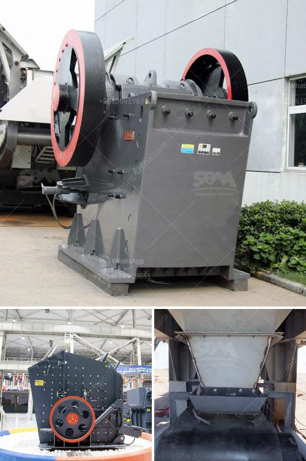

<h3>gypsum production powder manufacturers in europe</h3>
Gypsum is widely used in construction materials and products for its excellent fire resistance, durability, and versatility. In Europe, the construction industry accounts for a significant share of the gypsum market. As a result, there are many gypsum production powder manufacturers in Europe.

One of the leading gypsum production powder manufacturers in Europe is Saint-Gobain. The company has four production sites across Europe, located in France, Spain, Germany, and the United Kingdom. Saint-Gobain produces a wide range of gypsum products, including plasterboard, plaster, and industrial gypsum. Their products are known for their high quality and meet the strictest European standards.

Another prominent manufacturer in Europe is Knauf. With production facilities in several European countries, including Germany, France, Spain, and the United Kingdom, Knauf is a major player in the gypsum industry. They offer a diverse range of gypsum products, such as plasterboards, plasters, and ceiling tiles. Knauf has a strong focus on sustainability, implementing green manufacturing practices and using recycled materials whenever possible.

Eurogypsum is an association that represents gypsum producers in Europe. It counts numerous member companies spread across the continent, including major players like Saint-Gobain and Knauf. Eurogypsum aims to promote the benefits of gypsum products, support research and innovation, and advocate for sustainable building practices. The association serves as a platform for collaboration among manufacturers, enabling them to exchange knowledge and best practices.

Gypsum production powder manufacturers in Europe have embraced technological advancements to improve their manufacturing processes. Advanced equipment and automation ensure higher production efficiency, consistency in product quality, and reduced energy consumption. Manufacturers invest heavily in research and development to create innovative and sustainable solutions. For instance, they work on developing gypsum-based materials with enhanced fire resistance or improved acoustic properties.

Besides its use in traditional construction materials, gypsum also finds application in various industrial sectors, such as agriculture, food, and pharmaceuticals. The European gypsum manufacturers cater to these specialized industries as well, providing tailor-made products for specific requirements. Gypsum powder, for example, is widely used as a soil amendment in agriculture, improving soil structure and nutrient availability.

Additionally, gypsum manufacturers in Europe prioritize environmental responsibility. They implement sustainable manufacturing practices, aiming to minimize the impact on the environment. These manufacturers focus on reducing water usage, energy consumption, and waste generation. Many have implemented recycling programs to minimize waste and increase material reuse.

Gypsum production powder manufacturers in Europe play a crucial role in the construction industry, providing high-quality gypsum products for various applications. They continuously invest in research and development to innovate and meet ever-evolving market demands. These manufacturers contribute to sustainable building practices by using recycled materials, reducing energy consumption, and striving for environmental responsibility. With their expertise and commitment to quality, European gypsum manufacturers are well-positioned to meet the growing demand for gypsum products in the construction sector.
<h3>Contact us</h3><ul><li><strong>Whatsapp:&nbsp;<a href="https://wa.me/8613661969651">+8613661969651</a></strong></li><li><a href="https://swt.shibang-china.com/?git&amp;zhl&amp;gypsum production powder manufacturers in europe"><strong>Online Service(chat now)</strong></a></li></ul><h3>Related</h3><ul><li><a href='granite and marble mining in uganda.md'>granite and marble mining in uganda</a></li><li><a href='ton per jam jaw crusher.md'>ton per jam jaw crusher</a></li><li><a href='barite crusher equipment.md'>barite crusher equipment</a></li><li><a href='mini cement plant project cost india.md'>mini cement plant project cost india</a></li><li><a href='hard rock crushers.md'>hard rock crushers</a></li></ul>