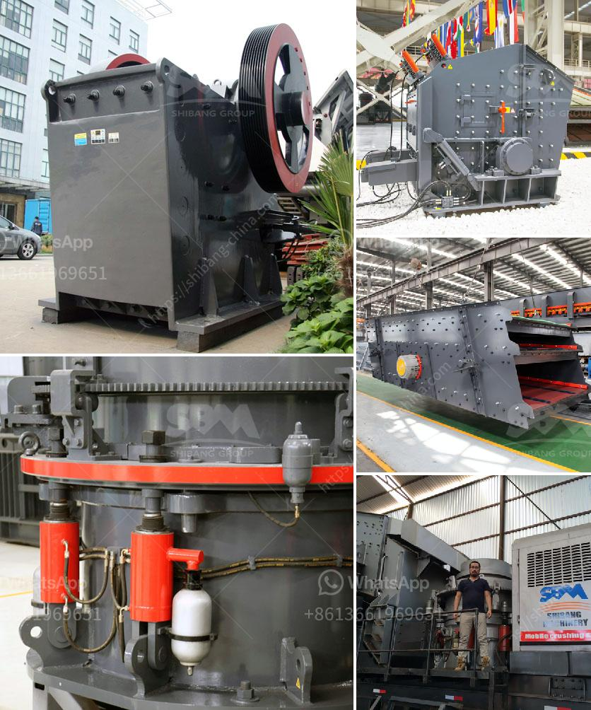

<h3>hammer mill 25 ton hour</h3>
A hammer mill is a versatile machine utilized for size reduction of different materials. It works on the principle of impact between the material and the hammers, allowing for efficient and reliable particle size reduction. The hammer mill can be used as a primary, secondary, or tertiary crusher, depending on the application.

The hammer mill is designed to handle a wide range of materials, including brittle, fibrous, soft materials, and hard minerals. Its robust construction and low maintenance requirements make it a suitable choice for continuous operation in various industries. From food processing to mining, the hammer mill is indispensable in ensuring the desired particle size for further processing or end use.

A hammer mill capable of processing 25 tons of materials per hour is a magnificent feat. The rugged and durable structure ensures long-term and consistent performance, while its high-speed operation guarantees efficient and effective production. Additionally, the hammer mill's capacity can be adjusted to cater to specific production requirements, providing adaptability and versatility to suit various applications.

With its unique design and features, the hammer mill is renowned for its superior particle size reduction capabilities. The materials are fed into the mill through a feed chute, where they come into contact with rotating hammers. The impact of the hammers crushes, grinds, or pulverizes the materials, resulting in the desired particle size.

The use of a hammer mill offers multiple advantages. First and foremost, it provides control over the particle size, enabling manufacturers to achieve consistency in their end products. Furthermore, it saves energy by requiring less horsepower compared to other crushing methods. This makes the hammer mill a cost-effective solution for reducing materials.

In conclusion, a hammer mill capable of processing 25 tons of materials per hour is a reliable and efficient machine for particle size reduction. Its versatility and ability to handle a wide range of materials make it an essential tool in various industries. Whether used in food processing, mining, or any other application, the hammer mill guarantees consistent performance, energy efficiency, and superior particle size reduction.
<h3>Contact us</h3><ul><li><strong>Whatsapp:&nbsp;<a href="https://wa.me/8613661969651">+8613661969651</a></strong></li><li><a href="https://swt.shibang-china.com/?git&amp;zhl&amp;hammer mill 25 ton hour"><strong>Online Service(chat now)</strong></a></li></ul><h3>Related</h3><ul><li><a href='the cost of a clay brick making machine in south africa.md'>the cost of a clay brick making machine in south africa</a></li><li><a href='coal crusher 350tph.md'>coal crusher 350tph</a></li><li><a href='calcium carbonate plant sell in india.md'>calcium carbonate plant sell in india</a></li><li><a href='south africa limestone crushing and blending plant.md'>south africa limestone crushing and blending plant</a></li><li><a href='ball mill in copper plant.md'>ball mill in copper plant</a></li></ul>