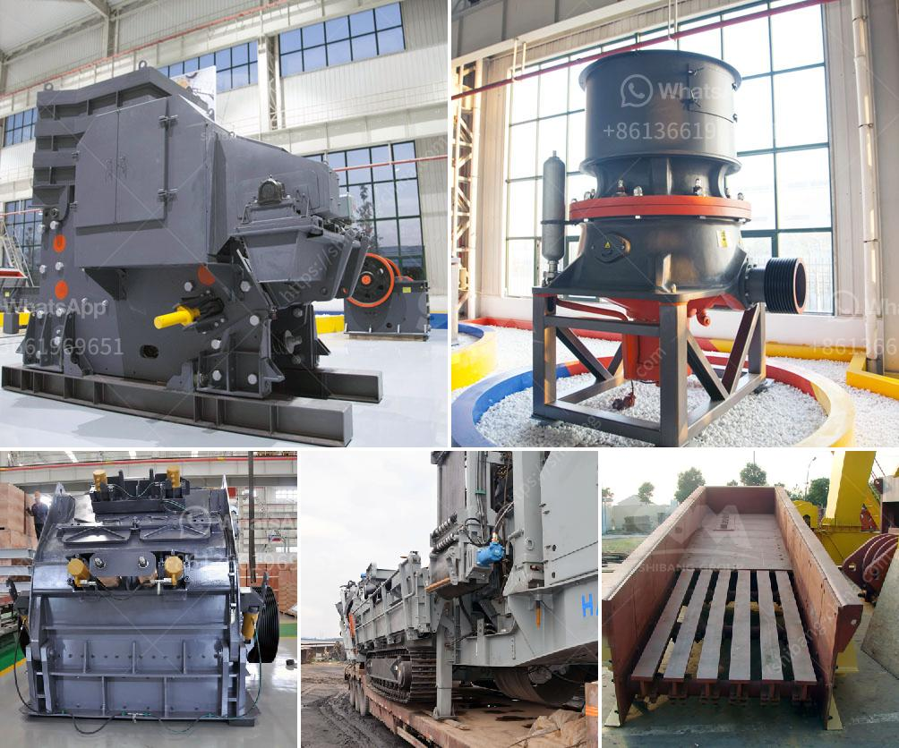

<h3>hammer mill 40 ton hour</h3>
The hammer mill is an essential piece of equipment in many industrial processes. It is particularly used in the grain processing industry and in biomass pellet production to reduce the size of the raw materials. The hammer mill can be equipped with different types of hammers, depending on the application, to optimize the production capacity and size reduction rate.

One popular hammer mill variant is a pilot-scale mill, commonly used in research laboratories for fine-grinding applications. This mill is capable of producing a fine, uniform grind of up to 40 tons per hour. It is designed for high production rates and easy operation. This hammer mill is equipped with a vibrating screen to separate the fine particles from the coarse ones, ensuring a consistent and high-quality end product.

The hammer mill operates by feeding the material into the grinding chamber where rotating hammer blades strike it until it is reduced to the desired size. The size of the final product can be adjusted by changing the screen size. This versatility makes the hammer mill an ideal choice for a wide range of applications, from animal feed production to biofuel manufacturing.

One of the key advantages of the hammer mill is its low energy consumption. This makes it an eco-friendly option that reduces the environmental impact of the production process. Additionally, the hammer mill requires minimal maintenance and is easy to clean, ensuring a long service life and efficient operation.

In conclusion, the hammer mill is a versatile and efficient piece of equipment that offers a wide range of advantages, including high production capacity, low energy consumption, and easy maintenance. If you are involved in the grain processing industry or biomass pellet production, investing in a hammer mill can greatly improve your productivity and profitability.
<h3>Contact us</h3><ul><li><strong>Whatsapp:&nbsp;<a href="https://wa.me/8613661969651">+8613661969651</a></strong></li><li><a href="https://swt.shibang-china.com/?git&amp;zhl&amp;hammer mill 40 ton hour"><strong>Online Service(chat now)</strong></a></li></ul><h3>Related</h3><ul><li><a href='sand washing machine for sale.md'>sand washing machine for sale</a></li><li><a href='business plan for a quarry crusher.md'>business plan for a quarry crusher</a></li><li><a href='diamond jaw crusher usa.md'>diamond jaw crusher usa</a></li><li><a href='quartz processing technique.md'>quartz processing technique</a></li><li><a href='granite and marble mining in uganda.md'>granite and marble mining in uganda</a></li></ul>