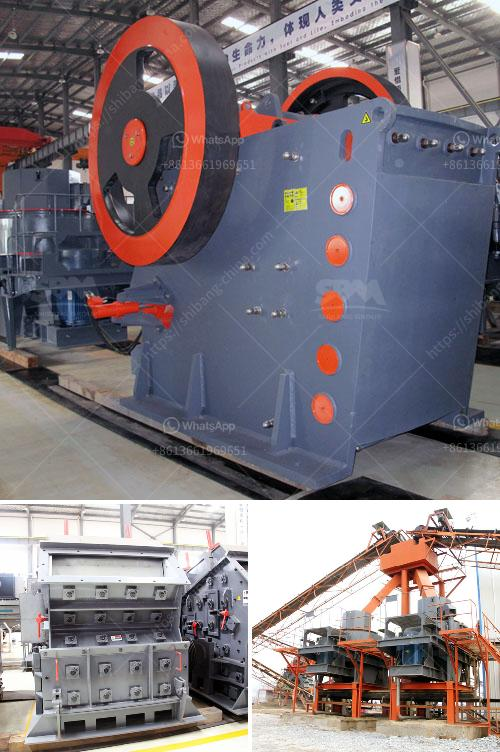

<h3>hammer mill aluminum slag</h3>
The use of aluminum slag, also known as dross, has been proven to be a valuable resource in the manufacturing of various products. One of the most common uses of aluminum slag is in the production of aluminum metal. Although aluminum metal can be produced from primary raw materials, the use of recycled aluminum significantly reduces energy consumption and lowers environmental impact.

To extract aluminum metal from aluminum slag, it is necessary to break down the slag into finer particles. This is where the hammer mill comes into play. With the use of various hammers, blades, and screens, the hammer mill quickly and efficiently reduces the aluminum slag into smaller pieces suitable for further processing.

The hammer mill consists of a rotor equipped with hammers that spin rapidly inside a cylindrical casing. The aluminum slag enters through an opening in the top of the casing and is impacted by the hammers as they continuously move around the rotor. The hammers break down the slag into smaller particles, while the screens inside the casing control the size of the output.

The output from the hammer mill is often referred to as aluminum slag grit or granules, depending on the final size. These particles are then processed further to extract aluminum metal. In addition to aluminum metal recovery, the hammer mill can also be used to reclaim other valuable elements, such as copper, brass, and zinc, from the slag.

In conclusion, the hammer mill is an efficient and cost-effective tool for breaking down aluminum slag and recovering valuable resources. The result is a more sustainable manufacturing process with reduced energy consumption and minimized waste. By utilizing the hammer mill, manufacturers can contribute to a circular economy by recycling aluminum slag and turning it into valuable products.
<h3>Contact us</h3><ul><li><strong>Whatsapp:&nbsp;<a href="https://wa.me/8613661969651">+8613661969651</a></strong></li><li><a href="https://swt.shibang-china.com/?git&amp;zhl&amp;hammer mill aluminum slag"><strong>Online Service(chat now)</strong></a></li></ul><h3>Related</h3><ul><li><a href='chinese ore processing plants.md'>chinese ore processing plants</a></li><li><a href='gold crushing plant.md'>gold crushing plant</a></li><li><a href='stone crusher unit project report.md'>stone crusher unit project report</a></li><li><a href='bauxite beneficiation plant.md'>bauxite beneficiation plant</a></li><li><a href='india crushers association.md'>india crushers association</a></li></ul>