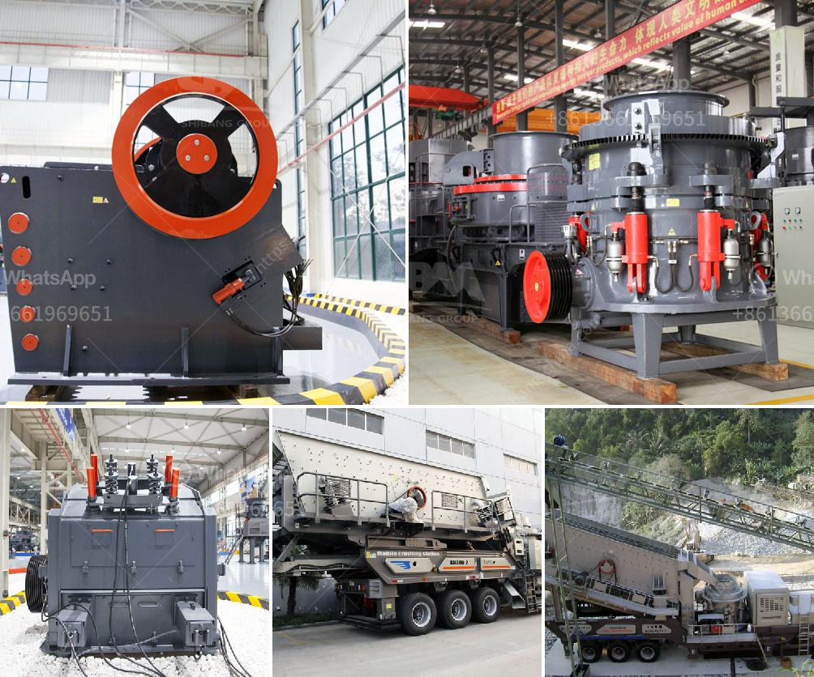

<h3>hammer mill for sale in zimbabwe</h3>
Hammer mill for sale in Zimbabwe, also known as maize grinding mill, is a robust and versatile small scale mill designed to crush and grind maize into grits, maize flour and bran. It is also suitable for crushing poultry feed, livestock feed, grinding oats, barley, and other grains.

Before delving into the hammer mill for sale in Zimbabwe, let's take a look at the main attributes and benefits of this equipment:

1. Robust construction: The hammer mill is made of high-quality materials such as cast iron and steel, ensuring its durability and long lifespan. It is designed to withstand heavy daily usage in a busy farming environment.

2. Versatility: This mill can process a wide range of grains and feed, making it suitable for various applications, including flour milling, animal feed production, and more. Its adaptability makes it a valuable addition to farms, small to medium-sized enterprises, and even larger commercial operations.

3. Efficient and fast: The hammer mill operates at high speed, resulting in quick and efficient processing of grains. It can process large quantities of grain within a short period, optimizing productivity and minimizing time wastage.

4. Adjustable grind sizes: The mill features an adjustable grate, allowing users to control the fineness of the final product. Whether you need fine maize flour for baking or coarse grits for animal feed, the hammer mill offers flexibility to match your specific requirements.

5. Cost-effective: Compared to larger milling machines, a hammer mill is much more affordable, making it ideal for small-scale farmers or entrepreneurs starting out in the agriculture industry. It is an investment that can bring significant returns, especially in regions where maize and grain products are in high demand.

Now that we understand the advantages of a hammer mill, let's explore the availability of this equipment in Zimbabwe.

Zimbabwe is known for its robust agricultural sector, with maize being one of the main crops grown in the country. The availability of a hammer mill for sale in Zimbabwe is an essential factor to consider when trying to find success in maize milling projects. These mills are specifically designed to grind maize into grits and flour, ensuring optimal grain size and nutrition retention.

In Zimbabwe, maize farming is a lucrative venture with high demand for maize products. To support this demand, local manufacturers and suppliers offer a wide range of robust and efficient hammer mills for sale in Zimbabwe. Whether you're buying for your individual needs or for commercial purposes, these machines can significantly boost your productivity and profitability.

Moreover, technology advancements have made it easier to find hammer mills for sale in Zimbabwe through online platforms and agricultural equipment stores. Online platforms provide access to a wider range of suppliers, offering competitive prices and product variations. Furthermore, suppliers often provide after-sales support, maintenance, and spare parts to ensure continuous operation and reduce downtime.

In conclusion, the availability of hammer mills for sale in Zimbabwe is an essential factor to consider for maize farmers looking to venture into maize milling projects. As with any investment, purchasing a hammer mill requires careful considerations and thorough research to ensure that the benefits it brings outweigh the costs. Nevertheless, with the right hammer mill, farmers and entrepreneurs can process their maize and grains efficiently, leading to increased productivity, profitability, and overall success in the agricultural sector.
<h3>Contact us</h3><ul><li><strong>Whatsapp:&nbsp;<a href="https://wa.me/8613661969651">+8613661969651</a></strong></li><li><a href="https://swt.shibang-china.com/?git&amp;zhl&amp;hammer mill for sale in zimbabwe"><strong>Online Service(chat now)</strong></a></li></ul><h3>Related</h3><ul><li><a href='quarry crusher for sale in nigeria.md'>quarry crusher for sale in nigeria</a></li><li><a href='rent a rock crusher saudi.md'>rent a rock crusher saudi</a></li><li><a href='aggregates crashing plant in nigeria.md'>aggregates crashing plant in nigeria</a></li><li><a href='price of concrete crushing machine for sale.md'>price of concrete crushing machine for sale</a></li><li><a href='crusher for marble.md'>crusher for marble</a></li></ul>