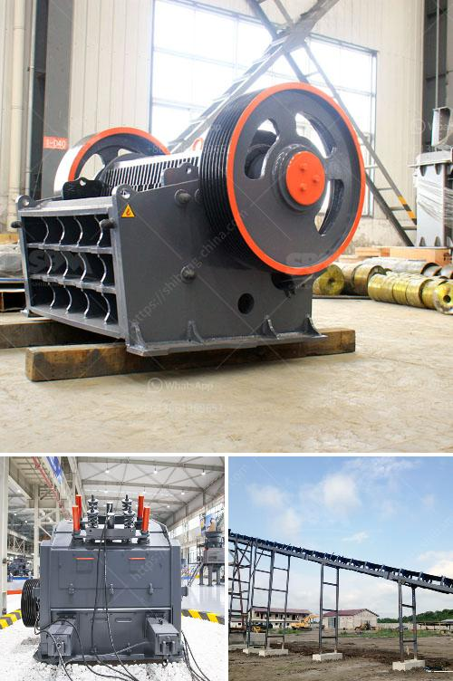

<h3>hammer mill gauteng</h3>
The hammer mill Gauteng is an industry-leading machine that is popularly used for shredding and grinding raw materials into small pieces. This robust machine is often utilized in different industrial sectors, such as agriculture, mining, and construction.

One of the key features that make the hammer mill Gauteng stand out is its ability to process a wide range of materials, including grains, wood chips, corn stalks, and agricultural residues, among others. This versatility makes it a critical machine in the biofuel and animal feed industries.

The hammer mill Gauteng operates by rotating the hammers at high speed, which strikes and shreds the materials into smaller particles. The size of the final product can be adjusted by changing the screen size and the speed of the rotor. This functionality allows users to achieve the desired output size for their specific applications.

In addition to its versatile design, the hammer mill Gauteng also offers several advantages that make it a preferred choice for many industries. Firstly, it has a simple and straightforward operation. The machine requires minimal training to operate, and its maintenance is relatively easy. This feature makes it suitable for both novice and experienced users.

Furthermore, the hammer mill Gauteng boasts remarkable efficiency. It can process large volumes of materials within a short period, resulting in enhanced production rates. This efficiency contributes to reducing operational costs and increasing overall productivity. Additionally, the machine's low energy consumption helps minimize the environmental impact, making it an eco-friendly choice.

The hammer mill Gauteng is also renowned for its durability and robustness. It is built to withstand heavy-duty applications and withstands the wear and tear of high-speed operations. This durability ensures long-term usability, reducing the need for frequent replacement or repairs.

The machine is available in different sizes and capacities to cater to various needs and production requirements. It can be customized to meet specific operational demands, ensuring optimal performance for different applications.

The use of the hammer mill Gauteng extends beyond shredding and grinding. It can also be utilized for particle size reduction, mixing, and densification processes. This flexibility allows users to maximize their investment by utilizing the machine for multiple purposes.

In conclusion, the hammer mill Gauteng is a versatile and efficient machine that is widely used in various industries. Its ability to process a wide range of materials, simple operation, and robust design make it a favored choice for shredding, grinding, and other particle size reduction applications. Whether it's the biofuel, animal feed, or construction industry, the hammer mill Gauteng delivers outstanding performance, productivity, and durability.
<h3>Contact us</h3><ul><li><strong>Whatsapp:&nbsp;<a href="https://wa.me/8613661969651">+8613661969651</a></strong></li><li><a href="https://swt.shibang-china.com/?git&amp;zhl&amp;hammer mill gauteng"><strong>Online Service(chat now)</strong></a></li></ul><h3>Related</h3><ul><li><a href='marble factory production line.md'>marble factory production line</a></li><li><a href='gypsum factory in pakistan.md'>gypsum factory in pakistan</a></li><li><a href='lime powder production equipment.md'>lime powder production equipment</a></li><li><a href='i need a second hand mobile stone crusher south africa.md'>i need a second hand mobile stone crusher south africa</a></li><li><a href='dental stone jaw crusher.md'>dental stone jaw crusher</a></li></ul>