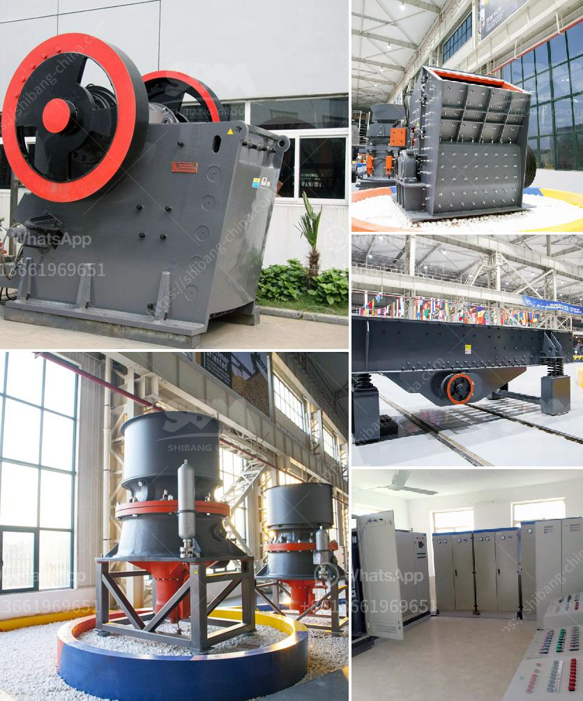

<h3>hammer mill grinder thailand</h3>
Hammer mill grinders are versatile machines used to grind many different materials, such as grinding grains, oats, barley, corn, and some spices. The mill grinders are perfect for farmers, and also for those who are planning to start a business in grinding grains. These efficient machines reduce the size of the materials by impacting them with a series of hammers, which rotate at high speed inside a cylindrical chamber.

Thailand, known for its rich agricultural industry, can greatly benefit from the use of hammer mill grinders. With the ability to quickly grind grains into fine powders, these grinders are ideal for the Thai farming community. Farmers can use the grinders to create animal feed and sell it to other farms or feed stores, providing an additional source of income. Moreover, properly processed grains can improve the overall health and productivity of livestock.

Additionally, the Thai spice industry can also reap great benefits from hammer mill grinders. By grinding spices such as chili, pepper, or coriander, Thai farmers can produce high-quality powders that can be sold to local markets or exported to other countries. With the growing demand for Thai spices globally, investing in a reliable hammer mill grinder can be a profitable venture for entrepreneurs in Thailand.

Furthermore, hammer mill grinders are also beneficial for waste reduction and environmental preservation. Instead of disposing of agricultural waste, farmers can use the grinders to repurpose it into valuable products. For example, rice husks can be ground into fine powder and used as fuel or fertilizer, reducing the dependency on non-renewable resources.

In conclusion, the hammer mill grinder is an essential tool for farmers and entrepreneurs in Thailand. By investing in this versatile machine, farmers can improve their agricultural efficiency, generate additional income, and contribute to waste reduction. Whether it is grinding grains or spices, hammer mill grinders provide a cost-effective and efficient solution for various industries in Thailand.
<h3>Contact us</h3><ul><li><strong>Whatsapp:&nbsp;<a href="https://wa.me/8613661969651">+8613661969651</a></strong></li><li><a href="https://swt.shibang-china.com/?git&amp;zhl&amp;hammer mill grinder thailand"><strong>Online Service(chat now)</strong></a></li></ul><h3>Related</h3><ul><li><a href='stone crushing in pakistan.md'>stone crushing in pakistan</a></li><li><a href='quarry crusher for sale in nigeria.md'>quarry crusher for sale in nigeria</a></li><li><a href='movable crushing plant.md'>movable crushing plant</a></li><li><a href='conveyor systems for sand and gravel.md'>conveyor systems for sand and gravel</a></li><li><a href='grinding mill machine in sri lanka.md'>grinding mill machine in sri lanka</a></li></ul>