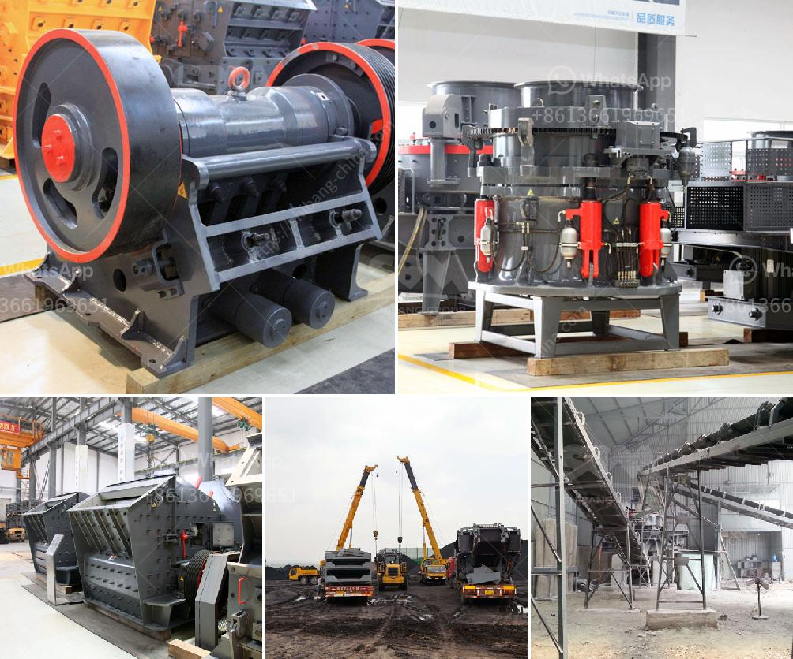

<h3>hammer mill in malaysia</h3>
The hammer mill is a machine that utilizes small hammers to crush or grind various materials. These machines have been around for many years, but in recent years they have gained popularity due to their ability to process materials such as small grains, corn, branches, and wood chips into a uniform size.

In Malaysia, hammer mills are well-known for their application in grinding and processing raw materials for animal feed. With an ever-increasing demand for animal feed, the use of hammer mills in this industry is expected to continue expanding.

As businesses seek ways to increase efficiency and reduce costs, the hammer mill technology provides them with an excellent solution. These machines not only save time and labor, but they also help to produce a higher quality end product. The uniform size and consistency of the processed material make it easier to mix and transport, resulting in improved feed production.

One of the advantages of using hammer mills is their versatility. They can be used to process a wide range of materials, including grains, vegetables, and even recycling materials such as wood chips. Moreover, they can be easily adjusted to produce different particle sizes, allowing businesses to cater to the specific needs of their customers.

The design of hammer mills typically consists of a casing with a feed inlet and outlet, a rotor, and hammers evenly spaced around the rotor. The rotor spins at a high speed, forcing the hammers to impact the material and break it down into smaller pieces. The crushed material then exits through the screens at the bottom of the mill.

The use of hammer mills in Malaysia has also extended to the production of biofuels. With the increasing demand for renewable energy sources, many businesses are exploring alternative fuel options. Hammer mills play a crucial role in processing biomass, such as wood chips, into smaller particles that can be used as feedstock for biofuel production.

In addition to the animal feed and biofuel industries, hammer mills are also used in other sectors such as food processing and recycling. Food manufacturers can utilize hammer mills to grind spices, grains, and other ingredients into a fine powder for various applications. Recycling plants can use hammer mills to process materials such as plastic, rubber, and metal, reducing them into smaller pieces that can be easily recycled.

In conclusion, hammer mills have become an important tool in Malaysia's industrial sector, particularly in the animal feed and biofuel industries. Their ability to process a wide range of materials into a uniform size has made them a preferred choice for many businesses. As the demand for processed materials and renewable energy sources continues to grow, hammer mills will likely play an even bigger role in Malaysia's economy.
<h3>Contact us</h3><ul><li><strong>Whatsapp:&nbsp;<a href="https://wa.me/8613661969651">+8613661969651</a></strong></li><li><a href="https://swt.shibang-china.com/?git&amp;zhl&amp;hammer mill in malaysia"><strong>Online Service(chat now)</strong></a></li></ul><h3>Related</h3><ul><li><a href='setting up a coal mining plant.md'>setting up a coal mining plant</a></li><li><a href='limestone crushing plant sale in pakistan.md'>limestone crushing plant sale in pakistan</a></li><li><a href='industrial application of ball mills.md'>industrial application of ball mills</a></li><li><a href='stone crusher machine for sale in kenya.md'>stone crusher machine for sale in kenya</a></li><li><a href='how to start a sand mining business in south africa.md'>how to start a sand mining business in south africa</a></li></ul>