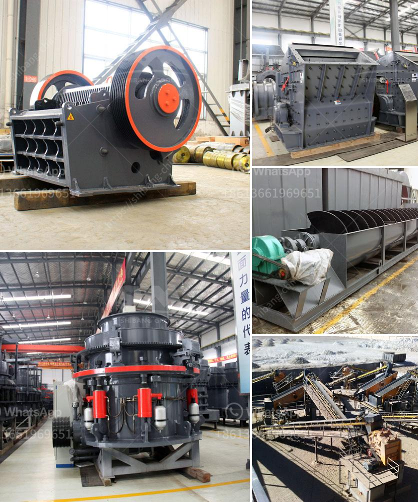

<h3>hammer mill malaysia</h3>
Hammer mill Malaysia is a machine used to shred or crush materials into smaller pieces. The basic design of this type of machine involves a rotating shaft or drum containing a series of hammers mounted on a central rotor hub. As the drum spins, the hammers swing freely and collide with the material being processed, breaking it down further.

One of the main applications of a hammer mill is in the agricultural industry, where it is commonly used for grinding grains, such as corn, into livestock feed. By pulverizing the grains, a hammer mill allows for more efficient digestion by animals, as the smaller particle size increases the surface area for digestion enzymes to work on. Additionally, the hammer mill can be used to create different sizes of feed to accommodate different livestock, ensuring optimal nutrition.

Aside from the agricultural sector, the hammer mill also finds its place in other industries, such as pharmaceuticals, chemistry, and recycling. Manufacturers of chemicals and pharmaceuticals may use a hammer mill to reduce the size of raw materials before further processing. In the recycling industry, a hammer mill can be utilized to shred plastic, paper, or other waste materials, making it easier to handle and recycle.

In Malaysia, the hammer mill is gaining popularity due to its versatility and efficiency. With the growing demand for animal feed and the increasing awareness of sustainable waste management, the hammer mill offers a solution that addresses both needs. Local farmers and industries can benefit from the convenience of having a hammer mill in their facilities, reducing the dependency on imported feed and minimizing waste buildup.

Furthermore, the availability of hammer mills in Malaysia provides an opportunity for local manufacturers to participate in the growing agriculture and recycling industries. By producing or exporting hammer mills, Malaysian businesses can tap into both domestic and international markets, contributing to economic growth.

In conclusion, the hammer mill Malaysia is an essential machine in various industries, offering numerous benefits, including efficient material shredding, cost-effectiveness, and environmental sustainability. Its versatility and applications make it a valuable asset for farmers, manufacturers, and recycling facilities alike. As Malaysia continues to advance in agriculture and waste management, the hammer mill plays a vital role in supporting these developments.
<h3>Contact us</h3><ul><li><strong>Whatsapp:&nbsp;<a href="https://wa.me/8613661969651">+8613661969651</a></strong></li><li><a href="https://swt.shibang-china.com/?git&amp;zhl&amp;hammer mill malaysia"><strong>Online Service(chat now)</strong></a></li></ul><h3>Related</h3><ul><li><a href='iron ore processing machine cost.md'>iron ore processing machine cost</a></li><li><a href='stone crusher machine for hire in mpumalanga.md'>stone crusher machine for hire in mpumalanga</a></li><li><a href='cocoa processing plant in india.md'>cocoa processing plant in india</a></li><li><a href='quarry crusher for sale in nigeria.md'>quarry crusher for sale in nigeria</a></li><li><a href='roller mill type p500.md'>roller mill type p500</a></li></ul>