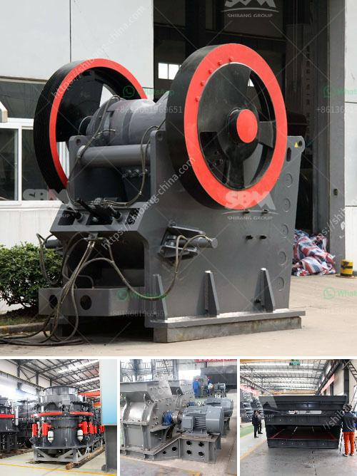

<h3>hammer mill stone crusher</h3>
A stone crusher is a machine used to convert large stones into smaller sizes that can be used in construction or other purposes. There are several types of stone crushing machines, which are differentiated based on the stone processing stages, namely primary crusher, secondary crusher and tertiary crusher. Each type of stone crusher has its own unique features and specifications.

One such machine that has been widely used in various construction and mining projects is the hammer mill stone crusher. The hammer mill stone crusher is a machine whose purpose is to shred or crush aggregate material into smaller pieces by the repeated blows of little hammers. The basic principle of hammer mill stone crusher revolves around a central rotor shaft, equipped with several hammers, which rotates at high speed to produce a strong impact force against the stone materials.

The process of using a hammer mill stone crusher is relatively simple. First, the stone material is fed into the machine's crushing chamber through the feed hopper, and it is crushed by the high-speed rotating hammerhead. The crushed stone material will then be discharged through the discharge port at the bottom of the machine. The size of the final crushed output can be adjusted by changing the gap between the hammerhead and the impact plate.

The hammer mill stone crusher is commonly used in stone-processing plants for the processing of secondary or tertiary level stone materials. It is particularly suitable for medium and fine crushing of medium hardness materials like limestone, slag, coke, coal, and other materials in cement, chemical, power, and metallurgical industries.

In conclusion, the hammer mill stone crusher is a versatile and high-efficiency machine that can process a wide range of stone materials. This crusher has the advantages of reliable performance, simple structure, convenient maintenance, and low operation cost. It is an essential equipment in the stone processing industry and is suitable for both small and large-scale stone crushing production.
<h3>Contact us</h3><ul><li><strong>Whatsapp:&nbsp;<a href="https://wa.me/8613661969651">+8613661969651</a></strong></li><li><a href="https://swt.shibang-china.com/?git&amp;zhl&amp;hammer mill stone crusher"><strong>Online Service(chat now)</strong></a></li></ul><h3>Related</h3><ul><li><a href='ethiopia unused cone crusher for sale.md'>ethiopia unused cone crusher for sale</a></li><li><a href='silica sand production plant in germany.md'>silica sand production plant in germany</a></li><li><a href='rock crushing plants.md'>rock crushing plants</a></li><li><a href='cheap used quarry machines italy.md'>cheap used quarry machines italy</a></li><li><a href='cone crusher supply.md'>cone crusher supply</a></li></ul>