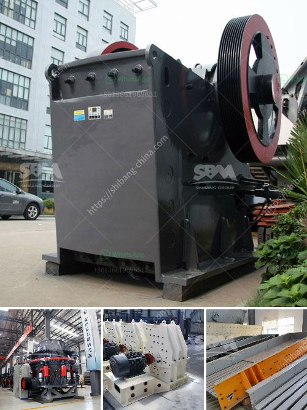

<h3>hammer mills factories</h3>
Grinding has always played a significant role in various industries, from agriculture to mining and everything in between. It is no secret that efficient grinding can contribute to increased productivity and reduced costs. One of the machines that have revolutionized the grinding process is the hammer mill. Hammer mills factories have become crucial in industries that require particle size reduction, and they have proven to be reliable and efficient.

So, what exactly is a hammer mill, and how do they work? A hammer mill is a machine that utilizes rotating hammers to crush and pulverize materials into smaller particles. It consists of a rapidly spinning rotor that is equipped with hammers and a grinding chamber. The materials to be ground are fed into the grinding chamber, where the rotor spins at high speeds, causing the hammers to strike and crush them. The crushed particles then pass through a screen, determining the desired particle size, and are discharged from the hammer mill.

One of the main advantages of hammer mills is their versatility and ability to handle a vast range of materials. From wood chips, grains, and straw to minerals, chemicals, and plastics, hammer mills can efficiently grind various materials. This versatility makes them suitable for a wide range of industries, including feed mills, ethanol production plants, wood pellet manufacturers, and more.

Hammer mills factories have undergone significant advancements and improvements over the years. Today, modern hammer mills are equipped with advanced features and technologies that enhance their efficiency, reliability, and ease of use. Features such as adjustable speed controls, interchangeable screens, and automatic feeding mechanisms enable manufacturers to achieve consistently precise grinding outcomes.

Hammer mills are known for their efficiency in reducing particle size. Their high-speed rotating hammers deliver powerful impacts, shattering the material into smaller fragments. This efficient grinding action allows for the production of uniform and consistent particle sizes. A narrow particle size distribution is crucial in many industries, such as pharmaceuticals and chemical manufacturing, where precise particle size control is essential.

Another advantage of hammer mills is their low maintenance requirements. Their robust construction and simple design make them durable and easy to operate. Regular maintenance tasks such as changing screens and replacing hammers are relatively straightforward. This simplicity translates into reduced downtime and increased productivity for manufacturers.

In conclusion, hammer mills factories have revolutionized the world of grinding. Their versatility, efficiency, and low maintenance requirements have made them indispensable in various industries. By leveraging the power of rotating hammers, these machines can grind a wide range of materials, from agricultural products to chemicals and minerals. As technology continues to advance, we can expect further improvements in the efficiency and performance of hammer mills, thereby driving innovation and growth in the industries they serve.
<h3>Contact us</h3><ul><li><strong>Whatsapp:&nbsp;<a href="https://wa.me/8613661969651">+8613661969651</a></strong></li><li><a href="https://swt.shibang-china.com/?git&amp;zhl&amp;hammer mills factories"><strong>Online Service(chat now)</strong></a></li></ul><h3>Related</h3><ul><li><a href='rotary dryer in cement industry.md'>rotary dryer in cement industry</a></li><li><a href='crusher in china.md'>crusher in china</a></li><li><a href='oman marble quarry companies.md'>oman marble quarry companies</a></li><li><a href='ballast crusher for sale kenya.md'>ballast crusher for sale kenya</a></li><li><a href='what is the hammer mill.md'>what is the hammer mill</a></li></ul>