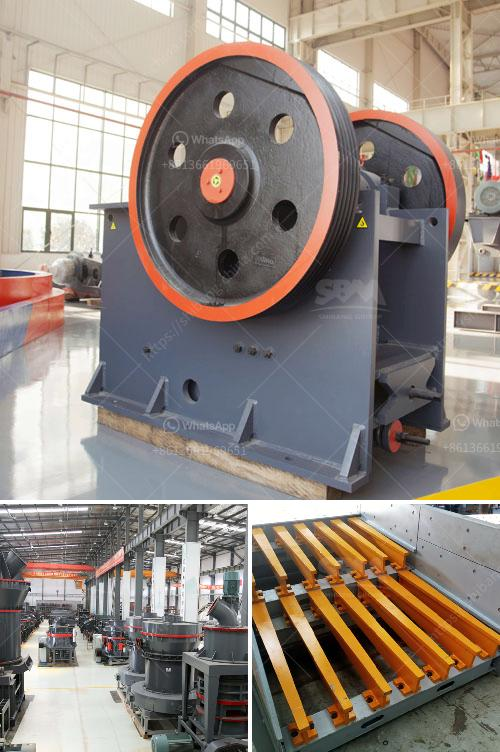

<h3>hammer mills for mining</h3>
Mining operations require robust and efficient machinery to ensure productivity and high returns on investment. Hammer mills have been an essential part of mining operations for decades as they provide high-quality materials for various industries. In this article, we will discuss the hammer mill's role in the mining industry and explore its applications.

Hammer mills are versatile machines used in the mining industry to reduce the size of materials like coal and ore. They can be utilized in a variety of applications, such as primary crushing of mined materials, grinding operations of raw materials in preparation for further processing, or recycling of demolished materials.

One of the key benefits of hammer mills is the ability to produce a wide range of particle sizes. This is achieved by controlling the size of the openings in the screens, which determines the final product size. Larger openings will produce a coarser product, while smaller openings will result in a finer product. The flexibility in particle size control allows for customization based on specific requirements of the end-user industry.

In the mining industry, hammer mills are commonly used to crush and grind a variety of ores. These can include copper, gold, limestone, and nickel. Minerals are subjected to a high-speed hammer impacting force, which results in disintegration of the materials. The material then passes through a sizing screen to achieve the desired particle size.

Apart from reducing the size of the ores, hammer mills can also be used for secondary and tertiary crushing processes. This makes them an ideal choice for crushing down large rocks and stones into smaller sizes. The smaller particles are then easier to handle and transport, improving efficiency throughout the mining process.

Additionally, hammer mills offer advantages in terms of energy efficiency and low operating costs. They typically consume less power compared to other machines, resulting in cost savings and reduced environmental impact. Their robust construction ensures minimal maintenance requirements, making them highly durable and reliable for prolonged use in harsh mining conditions.

Recycling is another area where hammer mills find applications in the mining industry. Demolition debris such as concrete and asphalt can be crushed into smaller pieces using a hammer mill, enabling easier handling and recycling. This sustainable practice not only conserves resources but also reduces the environmental impact associated with waste disposal.

In conclusion, hammer mills play a crucial role in the mining industry by providing top-quality materials for various purposes. Their ability to crush and grind a wide range of ores and materials makes them versatile and indispensable in mining operations. With their energy efficiency, low operating costs, and durability, they offer significant advantages for companies looking to optimize their mining processes. Furthermore, their application in recycling contributes to sustainable practices within the industry. As technology advances, the design and capabilities of hammer mills for mining applications are expected to further evolve, enhancing their effectiveness and efficiency in the years to come.
<h3>Contact us</h3><ul><li><strong>Whatsapp:&nbsp;<a href="https://wa.me/8613661969651">+8613661969651</a></strong></li><li><a href="https://swt.shibang-china.com/?git&amp;zhl&amp;hammer mills for mining"><strong>Online Service(chat now)</strong></a></li></ul><h3>Related</h3><ul><li><a href='marble crusher machine in rajasthan.md'>marble crusher machine in rajasthan</a></li><li><a href='stone crusher machine factory in china.md'>stone crusher machine factory in china</a></li><li><a href='ball mills for mining of 5000 tons per hour.md'>ball mills for mining of 5000 tons per hour</a></li><li><a href='used iron ore jaw crusher price nigeria.md'>used iron ore jaw crusher price nigeria</a></li><li><a href='mobile vsi crusher.md'>mobile vsi crusher</a></li></ul>