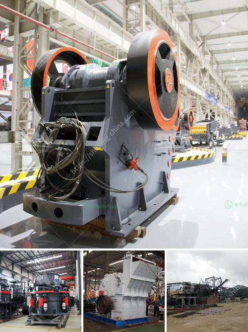

<h3>hammer mills semarang</h3>
Hammer mills Semarang have gained significant popularity in the industrial sector due to their versatility and efficiency. These machines have revolutionized the process of crushing and grinding various materials, making it easier and more cost-effective for businesses.

One of the key advantages of using hammer mills Semarang is their ability to reduce the particle size of materials. These machines consist of a rotating shaft with hammers attached to them. As the shaft rotates, the hammers repeatedly strike the material, breaking it into smaller pieces. This process is ideal for reducing the size of materials such as grains, biomass, and even certain minerals.

The versatility of hammer mills Semarang is another reason for their widespread use. They can handle a wide range of materials and achieve different particle sizes. This makes them well-suited for applications in industries such as agriculture, feed and grain processing, and even pharmaceuticals. Whether it's crushing corn for animal feed or pulverizing wood chips for biomass fuel, hammer mills Semarang can handle the job efficiently.

In addition to their crushing capabilities, hammer mills Semarang can also be used for grinding. By simply changing the screen sizes, these machines can produce different types of products, from coarse to fine powders. This grinding function makes them a valuable tool in industries where particle size control is crucial, such as manufacturing of pigments, chemicals, and spices.

Another key advantage of using hammer mills Semarang is their relatively low maintenance requirements. These machines are designed for heavy-duty operations and can handle continuous processing without significant wear and tear. Regular maintenance tasks such as lubrication and screen inspection are necessary, but overall, hammer mills Semarang offer a cost-effective solution for material processing needs.

In conclusion, hammer mills Semarang have revolutionized the industrial sector by providing an efficient and versatile solution for material crushing and grinding. Whether it's reducing the size of grains or producing fine powders, these machines deliver reliable results. With their low maintenance requirements and ability to handle a wide range of materials, hammer mills Semarang are a valuable investment for businesses looking to increase productivity and reduce costs.
<h3>Contact us</h3><ul><li><strong>Whatsapp:&nbsp;<a href="https://wa.me/8613661969651">+8613661969651</a></strong></li><li><a href="https://swt.shibang-china.com/?git&amp;zhl&amp;hammer mills semarang"><strong>Online Service(chat now)</strong></a></li></ul><h3>Related</h3><ul><li><a href='calcium powder machine.md'>calcium powder machine</a></li><li><a href='iron ore beneficiation.md'>iron ore beneficiation</a></li><li><a href='petroleum coke mill.md'>petroleum coke mill</a></li><li><a href='pulverizer for calcium carbonate.md'>pulverizer for calcium carbonate</a></li><li><a href='buy nigeria stone crusher.md'>buy nigeria stone crusher</a></li></ul>