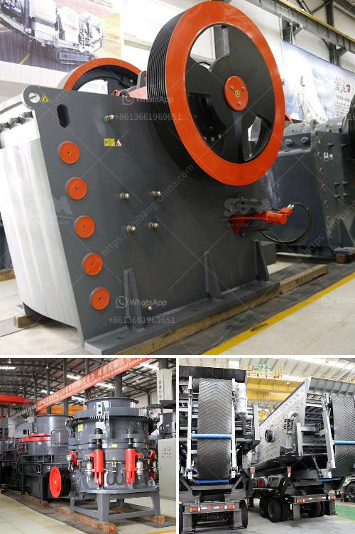

<h3>hammer vibrating screens usa</h3>
Hammer vibrating screens have become a popular choice in the United States due to their efficiency, durability, and versatility. These screens are widely used in various industries such as mining, construction, and recycling.

One of the main advantages of hammer vibrating screens is their ability to efficiently separate different materials. They are equipped with a high-powered hammer that generates strong vibrations, allowing the screen to separate large chunks of material into smaller, more manageable sizes. This is particularly beneficial in mining operations where large rocks or ore need to be reduced in size before further processing.

Another key benefit of hammer vibrating screens is their durability. These screens are built to withstand heavy use and can withstand the impact of large rocks or other materials. The powerful vibrations generated by the hammer ensure that the screens remain clear of any blockages or clogging, thereby maintaining the efficiency of the screening process.

Hammer vibrating screens also offer versatility in terms of applications. They can be easily adapted to different screening requirements by simply changing the screen plates or adjusting the vibration intensity. This makes them suitable for a wide range of materials, from small particles to coarser aggregates. Additionally, these screens can be used in various configurations, including inclined or horizontal orientations, depending on the specific needs of the application.

In recent years, the use of hammer vibrating screens in the recycling industry has gained traction. These screens are commonly used to separate different types of recyclable materials such as plastics, metals, and glass. The vibrations generated by the hammers help to separate the materials by size, allowing for efficient recycling processes.

Moreover, hammer vibrating screens have proven to be highly economical. Their low maintenance requirements and high efficiency contribute to cost savings in the long run. Additionally, the ability to customize the screens according to specific needs helps optimize the screening process, reducing energy consumption and maximizing the productivity of the operation.

When it comes to sourcing hammer vibrating screens in the USA, there are several reputable manufacturers offering high-quality products. These manufacturers ensure that their screens meet industry standards and provide reliable performance even in demanding applications. Furthermore, they provide excellent after-sales support, including technical assistance and spare parts availability, ensuring that customers can rely on their equipment for years to come.

In conclusion, hammer vibrating screens have become a popular choice in the USA due to their efficiency, durability, and versatility. These screens offer efficient separation of materials, withstand heavy use, and can be easily adapted to various applications. They are particularly useful in the mining, construction, and recycling industries. Moreover, hammer vibrating screens are economical, contributing to cost savings in the long run. When looking for hammer vibrating screens in the USA, customers can find reliable manufacturers offering high-quality products and excellent after-sales support.
<h3>Contact us</h3><ul><li><strong>Whatsapp:&nbsp;<a href="https://wa.me/8613661969651">+8613661969651</a></strong></li><li><a href="https://swt.shibang-china.com/?git&amp;zhl&amp;hammer vibrating screens usa"><strong>Online Service(chat now)</strong></a></li></ul><h3>Related</h3><ul><li><a href='stone quarry crusher machine.md'>stone quarry crusher machine</a></li><li><a href='price of grinding machine in bangladesh.md'>price of grinding machine in bangladesh</a></li><li><a href='jual ball mill second.md'>jual ball mill second</a></li><li><a href='small scale gold mining equipment in ghana price.md'>small scale gold mining equipment in ghana price</a></li><li><a href='cheap used quarry machines italy.md'>cheap used quarry machines italy</a></li></ul>