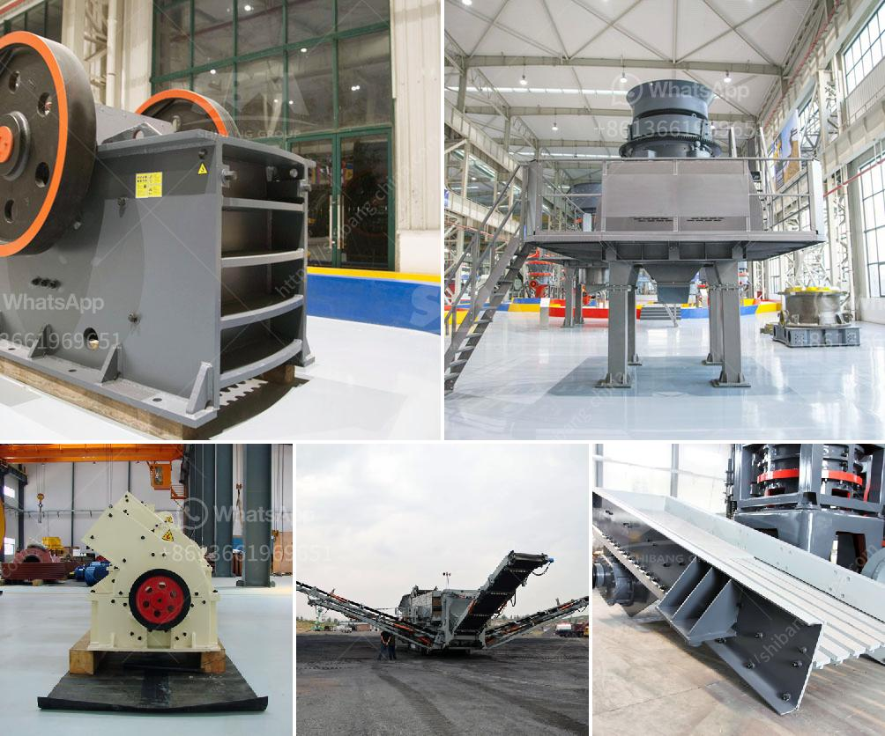

<h3>handmade rock crusher</h3>
Handheld rock crushers are fascinating pieces of machinery that could be used in a variety of fields, from mining to construction to garden landscaping. They are also relatively easy to construct and operate, making them appealing for both hobbyists and professionals alike. This article will explore the process of building a handmade rock crusher.

To begin with, it is important to understand what a rock crusher does and why it is useful. A rock crusher is a device used to crush rocks into smaller pieces, usually for gravel or some other road or building application. Most rock crushers have a hopper at the top -- a container which holds the rock above the crusher and uses gravity to feed it in. Alternately, rock crushers can use a belt drive to continuously transport the rock into the crusher.

The basic design of a rock crusher involves a piece of steel pipe with a piston-like contraption at the top. The piston will crush the rock and force it through the pipe. The crushed rock can then be collected in a container, while the smaller pieces, known as fines, fall through the gaps in the pipe.

1. Steel pipe: Look for a durable steel pipe that will resist bending or breaking under pressure. The size of the pipe will depend on the desired size of the crushed rocks.

2. Steel plate: This will act as the base for the rock crusher. The plate should be strong enough to handle the pressure exerted by the piston.

3. Piston: The piston is the most important component of the rock crusher. It should be made of durable materials that can withstand the force needed to crush the rocks. A solid metal cylinder would work well for this purpose.

4. Handle: A handle is needed to operate the rock crusher. It can be made from a sturdy material such as wood or metal.

1. Attach the steel plate to the base of the rock crusher. This will act as a sturdy foundation for the device.

2. Insert the piston into the steel pipe. Ensure that it fits snugly and can move up and down smoothly.

3. Attach the handle to the piston. The handle should be long enough for you to comfortably operate the rock crusher.

4. Test the device by placing rocks into the hopper and operating the handle. The piston should crush the rocks, forcing them out through the pipe. Adjust the mechanism if needed.

Building your own rock crusher can be a fun and rewarding project. It allows you to create a useful tool that can serve a variety of purposes, from crushing rocks for landscaping to crushing rocks for mining. With a few basic materials and some DIY skills, you can easily construct a handmade rock crusher that is both functional and efficient.
<h3>Contact us</h3><ul><li><strong>Whatsapp:&nbsp;<a href="https://wa.me/8613661969651">+8613661969651</a></strong></li><li><a href="https://swt.shibang-china.com/?git&amp;zhl&amp;handmade rock crusher"><strong>Online Service(chat now)</strong></a></li></ul><h3>Related</h3><ul><li><a href='mini cement plant project in india.md'>mini cement plant project in india</a></li><li><a href='ball mill problems and solutions.md'>ball mill problems and solutions</a></li><li><a href='bentonite powder plant in uae.md'>bentonite powder plant in uae</a></li><li><a href='gypsum board manufacturing plant cost.md'>gypsum board manufacturing plant cost</a></li><li><a href='new technology stone crusher.md'>new technology stone crusher</a></li></ul>