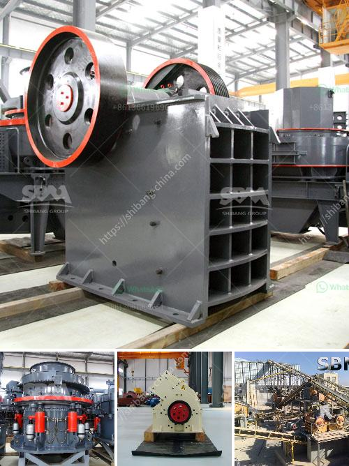

<h3>hard rock crushers</h3>
In the ever-evolving world of mining and ore processing, hard rock crushers have established their place as a staple piece of machinery. Serving different industries, these powerful machines provide reliable and efficient crushing capabilities which ensure the final product's integrity and quality.

Hard rock crushers are machines used to reduce the size of rocks and stones for further processing. These devices are designed to crush a wide range of materials, from limestone to granite or even concrete and asphalt. With a robust construction and vast crushing capacity, they are an essential tool in various industries such as mining, construction, and demolition.

One of the primary advantages of hard rock crushers is their ability to handle large feed sizes. These machines have powerful motors and sturdy construction, which allow them to break down even the toughest rocks effortlessly. This ensures maximum efficiency and productivity, as smaller rocks can be processed faster, resulting in reduced overall operational costs.

Another key benefit of hard rock crushers is their versatility. These machines come in several configurations such as jaw crushers, impact crushers, and cone crushers, each designed for specific requirements. For instance, jaw crushers excel at primary crushing, while impact crushers are ideal for secondary or tertiary crushing applications. Cone crushers, on the other hand, provide finer and more uniform particle sizes, making them suitable for precise end-product specifications.

Additionally, hard rock crushers are built to withstand harsh working conditions, including extreme temperatures and heavy-duty operations. This durability translates into long machine life and reduced downtime, ultimately leading to higher profitability for industries utilizing them.

The continuous advancements in technology have also played a significant role in enhancing the performance of hard rock crushers. Many manufacturers integrate intelligent control systems that optimize the crushing process for higher efficiency and product consistency. Furthermore, some crushers are equipped with automation features, enabling remote monitoring and adjustment, thereby minimizing human error and improving safety at the worksite.

In conclusion, hard rock crushers have revolutionized the mining and ore processing industries. Their robust construction, versatility, and advanced features make them indispensable for companies looking to extract value from various materials. Whether it is breaking limestone for cement plants or grinding aggregates for asphalt production, hard rock crushers continue to be at the forefront, breaking boundaries in crushing efficiency.
<h3>Contact us</h3><ul><li><strong>Whatsapp:&nbsp;<a href="https://wa.me/8613661969651">+8613661969651</a></strong></li><li><a href="https://swt.shibang-china.com/?git&amp;zhl&amp;hard rock crushers"><strong>Online Service(chat now)</strong></a></li></ul><h3>Related</h3><ul><li><a href='coal processing plants south africa.md'>coal processing plants south africa</a></li><li><a href='operation of stone crushing plant.md'>operation of stone crushing plant</a></li><li><a href='cement concrete crusher equipment.md'>cement concrete crusher equipment</a></li><li><a href='price of jaw crusher germany.md'>price of jaw crusher germany</a></li><li><a href='gold ore crushing machine.md'>gold ore crushing machine</a></li></ul>