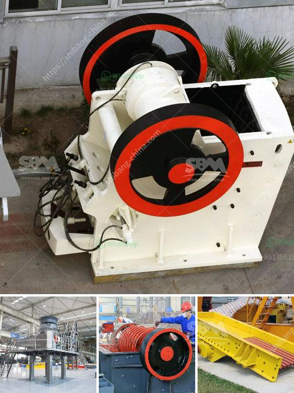

<h3>hard rock gold mining equipment</h3>
Hard rock gold mining equipment is a vital part of your gold mine operation. Because the equipment needs to be specially designed to extract gold from hard rock deposits, it must be efficient and effective for your operation to be successful.

The most common types of equipment used in hard rock gold mining are jaw crushers, impact crushers, cone crushers, and grinding mills. These machines work together to break up the rock into smaller pieces that can be processed further. 

Jaw crushers are used to break down larger rocks into smaller pieces. These machines have two jaws, one stationary and one moving, which work together to crush the rock. These crushers are ideal for use in the initial stages of the mining process.

Impact crushers are used when the rock needs to be broken down further. These machines use a high-speed rotor and anvils to apply force to the rock, breaking it into even smaller pieces. Impact crushers are particularly useful for processing larger pieces of rock.

Cone crushers are used to crush the smaller rock pieces into even smaller particles. These machines have a rotating cone-shaped mantle that applies pressure to the rock, crushing it against the concave bowl. Cone crushers are commonly used in secondary or tertiary crushing stages.

Grinding mills are used to further grind the crushed rock into a powder, which can be processed to extract the gold. These mills can be either ball mills or rod mills. Ball mills use steel balls inside a rotating drum to grind the rock, while rod mills use rods instead of balls. Both types of mills are effective in grinding the rock to the desired size.

In conclusion, hard rock gold mining equipment is essential for the successful operation of your gold mine. These machines are designed to extract gold from hard rock deposits and are efficient in breaking down the rock into smaller pieces. By using a combination of jaw crushers, impact crushers, cone crushers, and grinding mills, you can achieve maximum gold recovery from your hard rock ore.
<h3>Contact us</h3><ul><li><strong>Whatsapp:&nbsp;<a href="https://wa.me/8613661969651">+8613661969651</a></strong></li><li><a href="https://swt.shibang-china.com/?git&amp;zhl&amp;hard rock gold mining equipment"><strong>Online Service(chat now)</strong></a></li></ul><h3>Related</h3><ul><li><a href='copper crusher manufacturer in turkey.md'>copper crusher manufacturer in turkey</a></li><li><a href='cement production plant.md'>cement production plant</a></li><li><a href='jaw crusher 200 tph parts details.md'>jaw crusher 200 tph parts details</a></li><li><a href='basalt production equipment.md'>basalt production equipment</a></li><li><a href='oman marble quarry companies.md'>oman marble quarry companies</a></li></ul>