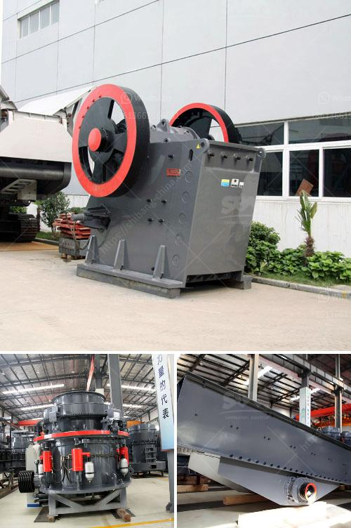

<h3>hard stone aggregate crusher price</h3>
When it comes to construction projects, there is no denying the importance of high-quality aggregates. These are the materials used to create a solid foundation for buildings, roads, and other infrastructure. One of the key players in the production of aggregates is the hard stone aggregate crusher.

A hard stone aggregate crusher is a machine designed to crush hard stones into smaller pieces. These machines are widely used in construction sites and quarries to crush and process stones. With the increasing demand for aggregates, it has become more important than ever to ensure that the crusher you choose is reliable and efficient.

The price of a hard stone aggregate crusher can vary depending on various factors such as the quality of the equipment, the level of automation, and the capacity of the machine. In general, a high-quality crusher with advanced features and a larger capacity will come at a higher price.

However, it is important to keep in mind that investing in a high-quality crusher can lead to significant savings in the long run. A reliable crusher will require less maintenance and repair, resulting in lower downtime and higher productivity. Moreover, the high-quality aggregates produced by a good crusher will lead to improved construction quality and durability.

The capacity of the crusher is another important factor that can influence the price. Crushers with higher capacities can process larger quantities of stones in a shorter time, which can be crucial in meeting project deadlines. However, it is essential to evaluate your specific needs and choose a crusher with an appropriate capacity. Buying a machine with excessive capacity can result in unnecessary expenses.

Automation is another feature that can affect the price of a hard stone aggregate crusher. More advanced crushers come with automated systems that help in optimizing the crushing process. These systems can adjust the crusher settings based on the type and size of the stones, resulting in improved efficiency and reduced wear and tear on the machine. While automation can increase the initial cost, it can also lead to significant savings in terms of maintenance and operating costs.

It is always recommended to compare prices and features from different suppliers before making a purchase. Look for suppliers who offer competitive prices without compromising on the quality of the machines. Additionally, consider the after-sales support provided by the supplier. A supplier who offers reliable technical assistance and spare parts will ensure that your crusher remains in optimal condition for years to come.

In conclusion, the price of a hard stone aggregate crusher can vary depending on factors such as quality, capacity, and level of automation. While it is important to consider the price, it is equally crucial to prioritize the reliability and efficiency of the machine. Investing in a high-quality crusher will not only result in improved construction quality but also lead to long-term savings. Therefore, take the time to research and choose a crusher that suits your specific needs and budget.
<h3>Contact us</h3><ul><li><strong>Whatsapp:&nbsp;<a href="https://wa.me/8613661969651">+8613661969651</a></strong></li><li><a href="https://swt.shibang-china.com/?git&amp;zhl&amp;hard stone aggregate crusher price"><strong>Online Service(chat now)</strong></a></li></ul><h3>Related</h3><ul><li><a href='diamond jaw crusher usa.md'>diamond jaw crusher usa</a></li><li><a href='diesel engine hammer mill crusher.md'>diesel engine hammer mill crusher</a></li><li><a href='hammer mill gauteng.md'>hammer mill gauteng</a></li><li><a href='portable crushers for rent.md'>portable crushers for rent</a></li><li><a href='closs size setting jaw crusher.md'>closs size setting jaw crusher</a></li></ul>