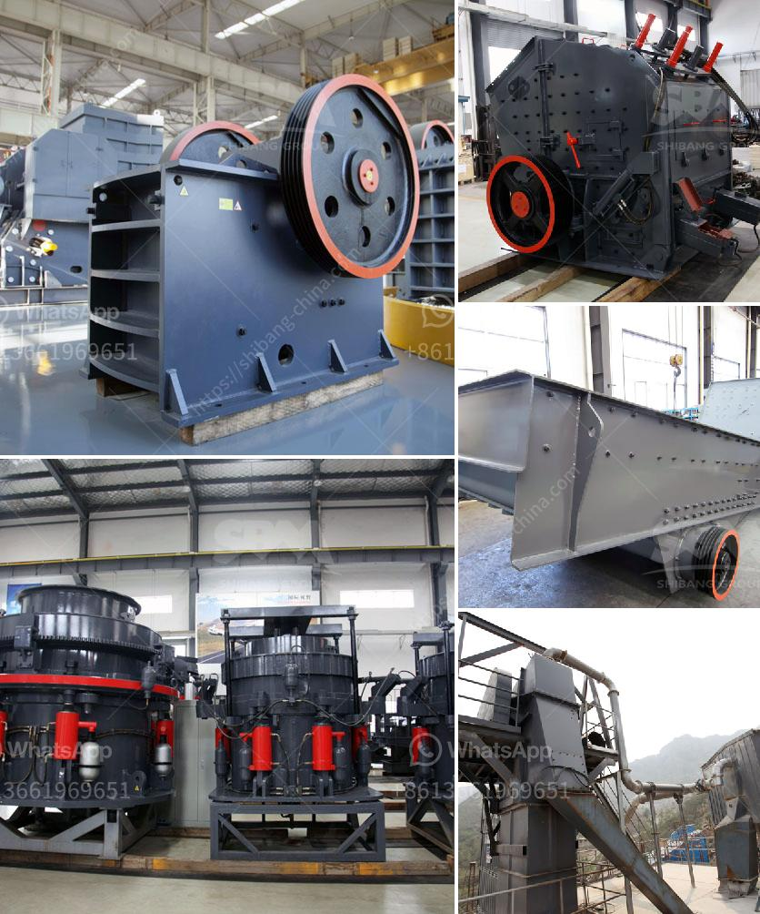

<h3>harga jaw crusher 400x600</h3>
In stone crushing line, the equipment mainly used is the crusher. With the same model, the price may vary greatly. Like many manufacturers, we will launch a promotion campaign to serve the customers and try to win customers' favor. In this article, I will share the reasons for the low price of the harga jaw crusher 400x600 with you.

First and foremost, the price of the jaw crusher we produce is relatively low. This is mainly because our strong manufacturing capacity enables us to produce large quantities of equipment, and we can save a lot of production costs as a result. At the same time, we have established long-term cooperation with large-scale raw material suppliers, which allows us to obtain raw materials at a relatively low price. All these factors contribute to the low price of our jaw crusher.

Secondly, although the price of the jaw crusher is low, its performance is not compromised. Our jaw crusher is made of high-quality materials and advanced manufacturing technology, which ensures its durability and stable performance. It has a large crushing ratio, high production efficiency, and low energy consumption. Moreover, the discharge size is adjustable, which makes it suitable for various crushing requirements. In addition, our jaw crusher is equipped with a hydraulic system, which can quickly adjust the discharge port to control the size of the final product. This greatly improves the efficiency and convenience of the crushing operation.

Thirdly, our jaw crusher has a wide range of applications. It is suitable for crushing various materials with compressive strength less than 320 MPa, such as limestone, granite, marble, basalt, iron ore, river pebbles, etc. Whether it is used in the primary crushing process or the secondary crushing process, it can meet the production requirements of different customers.

Another important point is that our jaw crusher is easy to maintain. It has a simple structure and few vulnerable parts, which greatly reduces the maintenance workload. Moreover, we provide comprehensive after-sales service, including equipment installation, operation guidance, and regular maintenance. Our professional technicians will be at your service anytime to solve any problems you may encounter.

In summary, the harga jaw crusher 400x600 is an affordable and practical choice for stone crushing line. With its low price, excellent performance, and wide application, it can provide customers with a cost-effective crushing solution. If you are interested in our product, please feel free to contact us for more information.
<h3>Contact us</h3><ul><li><strong>Whatsapp:&nbsp;<a href="https://wa.me/8613661969651">+8613661969651</a></strong></li><li><a href="https://swt.shibang-china.com/?git&amp;zhl&amp;harga jaw crusher 400x600"><strong>Online Service(chat now)</strong></a></li></ul><h3>Related</h3><ul><li><a href='mobile screen machine.md'>mobile screen machine</a></li><li><a href='crusher manufacturers in india.md'>crusher manufacturers in india</a></li><li><a href='stone crushers for sale usa.md'>stone crushers for sale usa</a></li><li><a href='used stone crusher for sale europe.md'>used stone crusher for sale europe</a></li><li><a href='best machine brands for quarry.md'>best machine brands for quarry</a></li></ul>