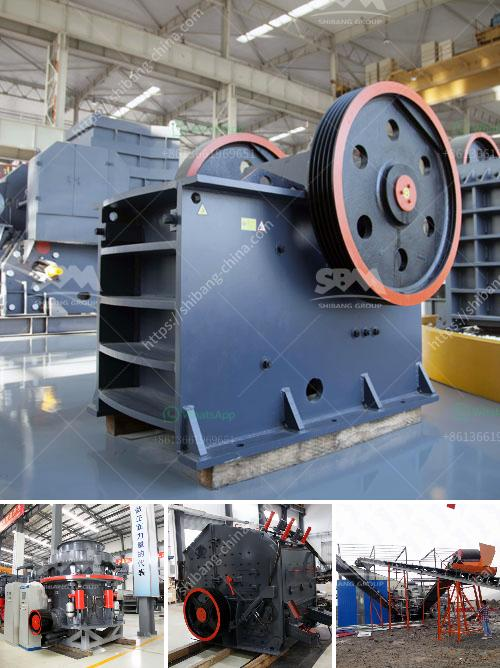

<h3>harga pasaran stone crusher</h3>
The construction industry in Indonesia has been growing steadily in recent years. With the government's focus on infrastructure development and urbanization, there has been a surge in demand for construction materials, such as stone aggregates, for building roads, bridges, and other infrastructure projects. One key equipment used in this process is a stone crusher.

Stone crushers are machines used to crush large stones into smaller sizes for road construction or other construction purposes. These machines are capable of breaking down hard rocks and ores into aggregates that can be used in concrete mixes or as raw materials for various construction projects. Consequently, the demand for stone crushers has increased in recent years, resulting in a rise in their market value or harga pasaran.

The market value or harga pasaran of stone crushers can vary considerably based on various factors. Some of these factors include the brand, capacity, size, and functionality of the machine. Stone crushers with higher capacity are generally priced higher than those with lower capacity. Additionally, machines with additional features or advanced technology may also be priced higher in the market.

The size of the stone crusher also plays a role in determining its market value. Smaller, more portable crushers are often more affordable than larger, stationary ones. This is because smaller crushers require less manpower and can be easily transported to different construction sites, resulting in cost savings for the buyers.

Another factor that impacts the harga pasaran of stone crushers is the growing competition among manufacturers. As the construction industry continues to thrive, more companies have entered the market, offering a wide range of stone crushers to cater to the increasing demand. This competition has led to a price war among manufacturers, resulting in more competitive pricing for stone crushers.

Besides, the availability of spare parts and after-sales service can also affect the market value of stone crushers. Buyers are often willing to pay a higher price for a crusher that comes with a reliable supply of spare parts and prompt after-sales service. This ensures that any maintenance or repair needs can be addressed promptly, minimizing downtime and maximizing the productivity of the machine.

In conclusion, the demand for stone crushers in the Indonesian construction industry has driven up their market value or harga pasaran. Various factors contribute to the pricing of stone crushers, including their capacity, size, brand, functionality, and competition within the market. Additionally, the availability of spare parts and after-sales service also adds value to the machines. As the construction industry continues to grow, the market value of stone crushers is expected to remain strong, attracting investments and innovation in this field.
<h3>Contact us</h3><ul><li><strong>Whatsapp:&nbsp;<a href="https://wa.me/8613661969651">+8613661969651</a></strong></li><li><a href="https://swt.shibang-china.com/?git&amp;zhl&amp;harga pasaran stone crusher"><strong>Online Service(chat now)</strong></a></li></ul><h3>Related</h3><ul><li><a href='standar operasional prosedur batubara mininh.md'>standar operasional prosedur batubara mininh</a></li><li><a href='cement plant machinery manufacturers in coimbatore.md'>cement plant machinery manufacturers in coimbatore</a></li><li><a href='secondary jaw crusher.md'>secondary jaw crusher</a></li><li><a href='stone crushers from china.md'>stone crushers from china</a></li><li><a href='crusher plant manufacturer from italy.md'>crusher plant manufacturer from italy</a></li></ul>