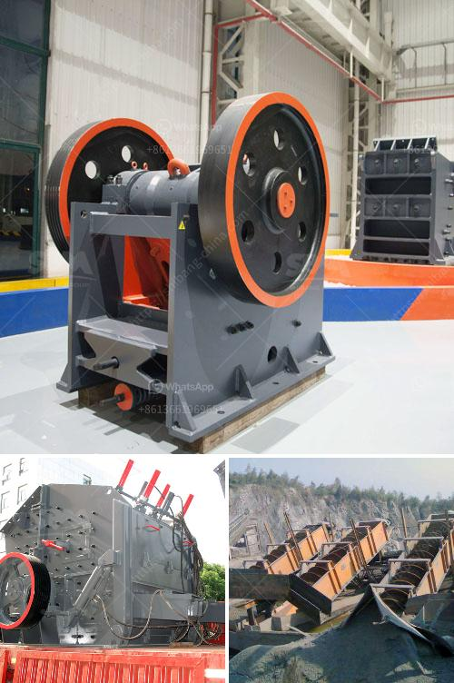

<h3>harga screw conveyor batching plant</h3>
In the construction industry, efficiency and productivity are key factors for success. One equipment that plays a vital role in enhancing productivity is the harga screw conveyor batching plant. This equipment is designed to transport materials such as concrete, cement, and aggregate from one location to another seamlessly, making the construction process smoother and more efficient.

A harga screw conveyor batching plant is a type of conveyor system that effectively moves materials in a factory or construction site. It consists of a rotating helical screw blade, also known as an auger, which is contained within a tube or a trough. As the screw rotates, the materials are pushed forward along the trough, delivering them to their desired location.

This type of batching plant is especially advantageous in construction projects that require a consistent supply of materials. Its ability to move large quantities of materials efficiently makes it a preferred choice for many contractors. The screw conveyor batching plant can be used to transport a wide range of materials, including sand, gravel, cement, and even small stones.

One of the key benefits of a harga screw conveyor batching plant is its versatility. It can be easily customized to suit specific project requirements. For instance, the length, diameter, and angle of the screw can be adjusted to accommodate different material types and volume. This flexibility allows contractors to easily adapt the batching plant to the needs of their projects.

Another advantage of using a screw conveyor batching plant is its durability and low maintenance. The design of the screw conveyor is simple and robust, reducing the risk of breakdowns and the need for frequent repairs. Additionally, it requires minimal lubrication, resulting in lower maintenance costs over time.

In conclusion, the harga screw conveyor batching plant is an essential equipment in the construction industry. Its ability to efficiently transport materials makes it a valuable asset that enhances productivity and reduces construction time. With its versatility and low maintenance requirements, it is a worthwhile investment for any construction project.
<h3>Contact us</h3><ul><li><strong>Whatsapp:&nbsp;<a href="https://wa.me/8613661969651">+8613661969651</a></strong></li><li><a href="https://swt.shibang-china.com/?git&amp;zhl&amp;harga screw conveyor batching plant"><strong>Online Service(chat now)</strong></a></li></ul><h3>Related</h3><ul><li><a href='granite crushing production line.md'>granite crushing production line</a></li><li><a href='mobile crushing stone machines from austria.md'>mobile crushing stone machines from austria</a></li><li><a href='portable silica sand washing machine.md'>portable silica sand washing machine</a></li><li><a href='stone crushing plant for sale in south africa.md'>stone crushing plant for sale in south africa</a></li><li><a href='equipment mining grinding equipment for mezcal price.md'>equipment mining grinding equipment for mezcal price</a></li></ul>