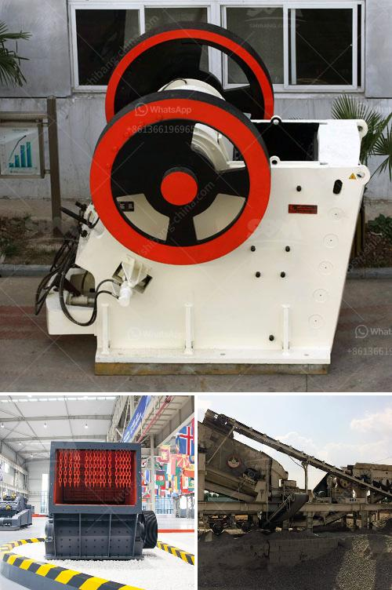

<h3>harga stone crusher 400 x 600 harga stone crusher</h3>
Stone crusher plays a very important role in modern industry and economy development, NOW there are a wide range of stone crushers on the China market, such as jaw crusher, cone crusher,impact crusher, hammer crusher, VSI crusher and so on. Different stone crusher has different crushing characteristics, so their price is also different.

Harga Stone Crusher 400 x 600 refers to the model of the stone crusher, whose feeding size is 400 mm x 600 mm. According to our experience, the price of a jaw crusher with a smaller feeding size is cheaper than the one with a larger feeding size. Therefore, the price of Harga Stone Crusher 400 x 600 is relatively affordable and reasonable.

The feeding size of stone crusher is smaller than the discharging size. Usually, it is broken by a jaw crusher, and then goes through impact crusher, cone crusher, and sand making machine for shaping. The crushed stone can be screened into various sizes like 35mm,20mm,12mm, etc. for different uses. And if the size of the final product is not suitable, an impact crusher can be used for reshaping.

Harga Stone Crusher 400 x 600 mainly consists of frame, eccentric shaft, jaw plate, connecting bar, adjustment part and spring.

The jaw crusher's main function is to reduce large-sized rocks or ore into smaller pieces for further process. It can be used as a primary crusher or secondary crusher for stone processing.

The motor drives the eccentric shaft to rotate through the belt pulley, making the jaw move up and down. When the movable jaw rises, the angle between the toggle plate and the movable jaw becomes larger, which pushes the movable jaw plate to approach the fixed jaw plate, thus achieving the purpose of crushing materials. When the movable jaw moves downward, the angle between the toggle plate and the movable jaw becomes smaller. The movable jaw plate leaves the fixed jaw plate under the action of the pull rod and the spring, and the crushed materials are discharged from the lower opening of the crushing chamber. With the continuous rotation of the motor, the motor jaw assembly periodically crushes and discharges materials to achieve mass production.

In conclusion, Harga Stone Crusher 400 x 600 is an affordable and reasonable price option for various stone crushing needs. Its crushing capacity can be adjusted and its operation is simple. The operation and maintenance are also easy and convenient, so it's becoming more and more popular among customers. Whether you need it for construction, mining, or any other purpose, Harga Stone Crusher 400 x 600 can be a reliable and efficient choice.
<h3>Contact us</h3><ul><li><strong>Whatsapp:&nbsp;<a href="https://wa.me/8613661969651">+8613661969651</a></strong></li><li><a href="https://swt.shibang-china.com/?git&amp;zhl&amp;harga stone crusher 400 x 600 harga stone crusher"><strong>Online Service(chat now)</strong></a></li></ul><h3>Related</h3><ul><li><a href='buy stone crusher in uae.md'>buy stone crusher in uae</a></li><li><a href='artificial sand production line.md'>artificial sand production line</a></li><li><a href='bauxite processing plant kenya.md'>bauxite processing plant kenya</a></li><li><a href='stone crushers for sale usa.md'>stone crushers for sale usa</a></li><li><a href='looking for a partner for machinery crusher.md'>looking for a partner for machinery crusher</a></li></ul>