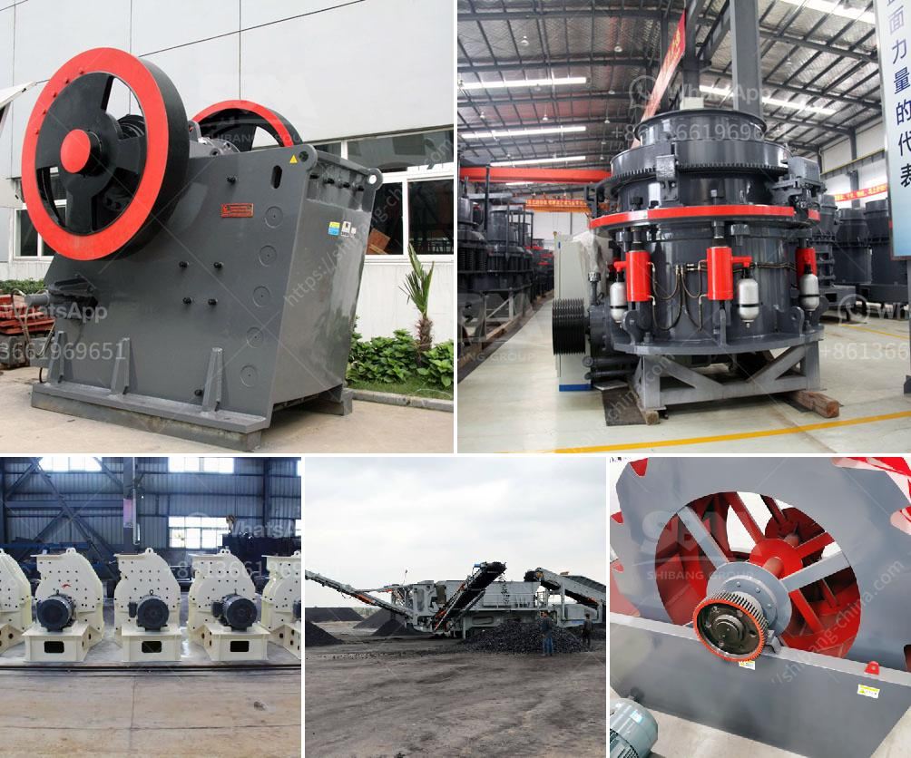

<h3>horizontal grinding mills price</h3>
Horizontal grinding mills are essential equipment in many industries, including mining, agriculture, and construction. These mills are primarily used to grind materials into fine particles, which is critical for various processes such as extraction, pulverization, and mixing. The high demand for horizontal grinding mills has led to a wide range of options available in the market, each with its own unique features and price point.

The price of horizontal grinding mills varies depending on several factors. The first and most significant factor is the mill's capacity. Mills with larger capacities typically have a higher price tag due to their ability to process larger quantities of materials in a shorter amount of time. Smaller mills with lower capacities have lower prices but may be more suitable for applications with lower production requirements.

Another factor that influences the price of horizontal grinding mills is the type of grinding mechanism used. There are various types available, including ball mills, rod mills, and autogenous (AG) mills. Each type has its own advantages and disadvantages, which can impact the price. Ball mills, for example, are commonly used in the mining industry and are relatively affordable due to their wide availability. On the other hand, AG mills are considered more efficient and robust but are generally more expensive.

Additionally, the material used to construct the mill affects its price. Mills can be made from various materials such as steel, cast iron, and ceramic. Steel is a commonly used material due to its strength and durability, and mills made from this material are usually priced competitively. Cast iron mills can offer similar performance but may be more expensive due to the manufacturing process. Ceramic mills, although less common, are popular for grinding materials that are highly abrasive or sensitive to contamination. However, they tend to be pricier due to their specialized nature.

Other factors that can impact the price of horizontal grinding mills include the brand, additional features, and the supplier's reputation. Well-known and reputable brands often come with higher price tags due to their established quality and reliability. Certain mills may also have additional features such as digital controls, adjustable settings, or energy-saving mechanisms, which can increase the price. Finally, the supplier's reputation and level of customer service can influence the price, as a well-regarded supplier may provide better support and warranty options, which can be reflected in the overall cost.

In conclusion, the price of horizontal grinding mills can vary significantly based on factors such as capacity, type of grinding mechanism, construction material, brand, additional features, and supplier reputation. It is essential for buyers to consider their specific requirements and budget when choosing a mill to ensure they get the best value for their investment.
<h3>Contact us</h3><ul><li><strong>Whatsapp:&nbsp;<a href="https://wa.me/8613661969651">+8613661969651</a></strong></li><li><a href="https://swt.shibang-china.com/?git&amp;zhl&amp;horizontal grinding mills price"><strong>Online Service(chat now)</strong></a></li></ul><h3>Related</h3><ul><li><a href='nigeria granite crushers.md'>nigeria granite crushers</a></li><li><a href='sand washers machine.md'>sand washers machine</a></li><li><a href='marble factory production line.md'>marble factory production line</a></li><li><a href='rock processing plant.md'>rock processing plant</a></li><li><a href='business plan for aggregates production plant pdf.md'>business plan for aggregates production plant pdf</a></li></ul>