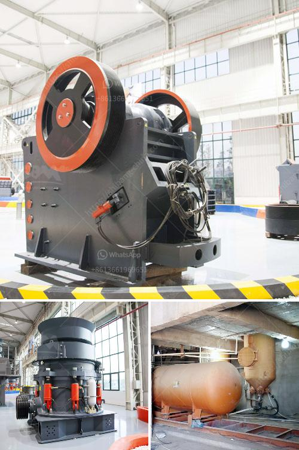

<h3>how does a stone crusher plant operate</h3>
A stone crusher plant is a profitable venture for new entrepreneurs. The demand for quality stone chips is increasing day-by-day. Stone Crusher Plant Market Opportunity

All the building constructions whether it is housing or industrial construction activities require crushed stone. Crushed stone is also required for cement based products like RCC pipes, PSC poles, cement concrete hollow blocks, precast cement concrete slabs, well rings, window and door frames and road laying. The demand for crushed stone will continue to grow with the growth of its user industry.

One of the most particular and general but most important materials used for making concrete is stone chips. These are used as filler with binding materials in the production of concrete.

Stone crusher plant machinery depends on the feed size of the stone, the desired product size and the size of the crusher used. Following are the generally required machinery:

First of all, break the big stone boulders to smaller size manually. Then it is fed to the stone crusher. The crusher can accept the stone size of 175mm. Stone crushing is the two-stage process. In the first stage, crush the 175mm stone to about 50mm. Thereafter, fit the crusher with a conversion kit to enable granulation of 5 to 20mm. Then screen the crushed material by the rotary screen. Unit location is a major factor for stone crusher plant business.

Authoritative sources (like Geology and Mining department of the State) to identify the rock formation and mining method suitable for extraction. Of course, the availability of initial aid facilities, including the availability of trained mine rescue team on standby basis are considered in a project before choosing the mining method.

On a polluting mine site with a fully operational plant, you’re not only actively planting trees to offset the carbon and rejuvenate the site, but you’re also boosting local employment in the area and assisting with the wider ecosystem recovery.

If the Crusher Units do not give good quality sand, which have a high percentage of arsenic, the plants will have a good market in the ethylene vinyl acetate and protector industry, which employs more women in low monetary jobs.

Ensure that the plants all have well-operated fire protection; otherwise, you too will be burned by the environment and norms.

Ensure that all waste belts and waste are covered with a specific type of fabric that will allow the crushed stone plants to “stick” and collect all cuttings and waste that are separated from the waste belt.

Dust control is another must-have for stone crusher plants. Pollution control is a vital aspect to operate any business these days.  

The milling industry to achieve the same requirements of DTM-N-1 in Laboratories of Analysis. All the raw materials are then mixed in proper proportions and loaded into a feed hopper and conveyed to a 2-chute cyclone for separation of fines before feeding to the 2-stage primary air classifier.

In conclusion, stone crusher plant is profitable. It has been a source of income for many start-ups because it offers a low initial investment and gives high returns. As with any business, a stone crusher plant promises good return on investment if managed properly. So, start with small investment and manage your business properly.
<h3>Contact us</h3><ul><li><strong>Whatsapp:&nbsp;<a href="https://wa.me/8613661969651">+8613661969651</a></strong></li><li><a href="https://swt.shibang-china.com/?git&amp;zhl&amp;how does a stone crusher plant operate"><strong>Online Service(chat now)</strong></a></li></ul><h3>Related</h3><ul><li><a href='cement company in protea glen.md'>cement company in protea glen</a></li><li><a href='prices of hammer mill in zimbabwe.md'>prices of hammer mill in zimbabwe</a></li><li><a href='ethiopia unused cone crusher for sale.md'>ethiopia unused cone crusher for sale</a></li><li><a href='silica sand crusher in ghana.md'>silica sand crusher in ghana</a></li><li><a href='working scale model stone crusher.md'>working scale model stone crusher</a></li></ul>