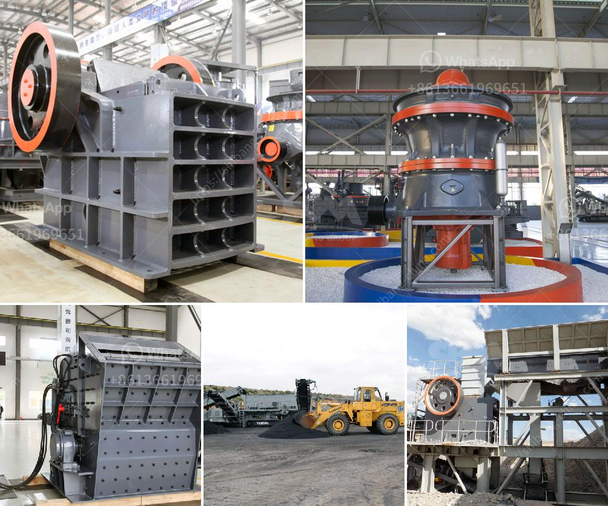

<h3>how does it hammer mill operats</h3>
In recent years, hammer mills have become an essential tool for many industries, allowing them to break down and reduce material particles to a more manageable size. However, despite their widespread use, not many people are fully aware of how they operate. This article aims to shed some light on how a hammer mill functions and the benefits it offers.

At its core, a hammer mill is a machine that uses rotating hammers attached to a spinning shaft to repeatedly strike material, thereby reducing it to a desired particle size. The material is fed into a hopper located at the top of the machine, where it is evenly distributed and directed towards the grinding chamber. The rotating hammers, which can range from two to six in number, begin to pulverize the material as soon as it enters the grinding chamber.

The grinding chamber, usually made of heavy-duty steel, is lined with serrated wear plates to enhance the impact and cutting action of the hammers. As the material passes through the chamber, the hammers continuously strike it, causing it to fracture and break down into smaller particles. The size of these particles is determined by the hole size of the screens that line the bottom of the grinding chamber. These screens can be easily interchanged to achieve different particle sizes, thus making the hammer mill a versatile piece of equipment.

While the hammers are responsible for the primary crushing process, a fan or blower located on top of the grinding chamber helps to draw the material and airflow towards the outlet. The airflow not only carries the material out of the hammer mill but also cools it down, ensuring that the machine doesn't overheat during prolonged operation.

Hammer mills are used in a variety of industries, including agriculture, pharmaceuticals, mining, and construction. In the agricultural sector, they are primarily used for grinding grains into animal feed or reducing wood chips and shavings into pellets for fuel. The pharmaceutical industry also relies on hammer mills to pulverize materials for medicinal purposes, while mining companies utilize them for crushing and refining ore. Additionally, hammer mills are commonly used in recycling operations to shred and break down various materials like cardboard, plastics, and paper.

One of the key advantages of a hammer mill is its ability to produce a consistent and uniform particle size. Traditional grinding methods, such as using a roller mill or ball mill, often result in uneven and oversized particles. Hammer mills, on the other hand, guarantee precise control over particle size and have proven to be more efficient than other grinding techniques.

In conclusion, a hammer mill is a versatile and reliable piece of equipment that plays a crucial role in various industries. Its ability to reduce material particles to a desired size efficiently and consistently makes it a go-to machine for many applications. By understanding how a hammer mill operates, it is clear to see why it remains a popular choice among manufacturers and processors alike.
<h3>Contact us</h3><ul><li><strong>Whatsapp:&nbsp;<a href="https://wa.me/8613661969651">+8613661969651</a></strong></li><li><a href="https://swt.shibang-china.com/?git&amp;zhl&amp;how does it hammer mill operats"><strong>Online Service(chat now)</strong></a></li></ul><h3>Related</h3><ul><li><a href='used sand mobile washing equipment.md'>used sand mobile washing equipment</a></li><li><a href='hammer mills factories.md'>hammer mills factories</a></li><li><a href='stone crusher price in dubai.md'>stone crusher price in dubai</a></li><li><a href='for sale rock crushing tons.md'>for sale rock crushing tons</a></li><li><a href='barite grinding plants in nigeria.md'>barite grinding plants in nigeria</a></li></ul>