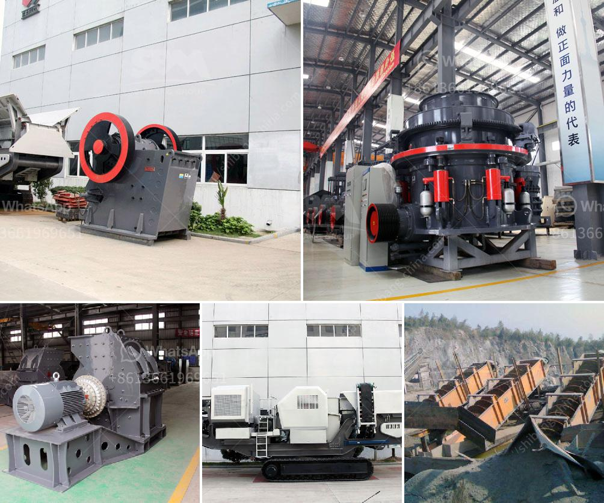

<h3>how much a stone crusher cost</h3>
Many customers ask this question frequently. The stone crushers have different types and models, and their prices are also different. So how much does a stone crusher cost?

Stone crusher is a machine designed to reduce large rocks into smaller rocks, gravel, sand, or rock dust. Crushers may be used to reduce the size, or change the form, of waste materials so they can be more easily disposed of or recycled, or to reduce the size of a solid mix of raw materials (such as in rock ore), so that pieces of different composition can be differentiated.

The stone crusher is an indispensable equipment for the stone crushing line. The reasonable configuration of the equipment will increase the production efficiency and the price will be more expensive. On the contrary, the price is low.

The investment in the equipment of a stone production line varies widely, depending on the specific production requirements, the scale of the production line, the configuration of the equipment, the cost of manpower, electricity, water, etc. Among them, the price of the stone crusher is more important.

As the leading mining crusher manufacturer and exporter in China, we will provide maximum preferential factory price and discount for you. Our stone crusher has been exported to South Africa, Kenya, Nigeria, Ethiopia, Zambia, Namibia, Somalia, Nepal, Pakistan, Philippines, Malaysia, Saudi Arabic and over 90 countries around the world.

The stone crusher is designed with large crushing rate, high yield, economic operating costs, simple structure, equal product size, reliable operation and easy maintenance. And because of the design of stone crusher, it becomes more and more popular in many industries.

There are several types of stone crushers, such as jaw crusher, impact crusher, cone crusher, hammer crusher, vertical shaft impact crusher,vibrating screen, etc. The following are the advantages of each type of stone crusher machine:

- Impact crusher: Can effectively process materials with large moisture content and prevent clogging of the crusher;

- Hammer crusher: Breaks materials through the high-speed rotating hammer head and collision with the rotor body;

- Vertical shaft impact crusher: Produces high-quality sand and gravel aggregate, with low wear and low energy consumption.

In conclusion, the choice of the crusher machine should be based on your requirements, such as hardness, output size, and investment budget. If you have large capitate and need more fine-sized products, you can choose impact crusher, cone crusher, or vertical shaft impact crusher. If you have medium or small size demands, we recommend jaw crusher. However, the cost of stone crusher plant is also different, so we suggest you evaluate your budget and your production line scale carefully before buying.

In conclusion, stone crusher plant is an essential equipment in the stone crushing process, the reasonable configuration of the production line will contribute to the economical benefit. A good quality stone crusher can bring high economic value to users and boost the development of the whole industry.
<h3>Contact us</h3><ul><li><strong>Whatsapp:&nbsp;<a href="https://wa.me/8613661969651">+8613661969651</a></strong></li><li><a href="https://swt.shibang-china.com/?git&amp;zhl&amp;how much a stone crusher cost"><strong>Online Service(chat now)</strong></a></li></ul><h3>Related</h3><ul><li><a href='limestone crusher rotor mechanical.md'>limestone crusher rotor mechanical</a></li><li><a href='companies selling mining equipment in dubai.md'>companies selling mining equipment in dubai</a></li><li><a href='raymond mill company.md'>raymond mill company</a></li><li><a href='price of 500 tph stone crusher plant in malaysia.md'>price of 500 tph stone crusher plant in malaysia</a></li><li><a href='cost of a medium size stone crusher.md'>cost of a medium size stone crusher</a></li></ul>