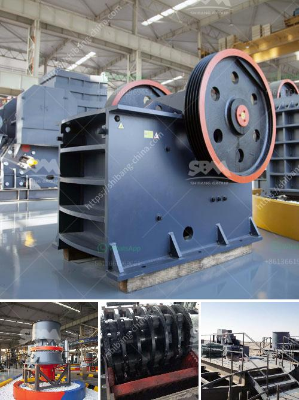

<h3>how much does a jaw crusher cost</h3>
Jaw crushers are widely used in mining, construction, and quarrying industry to crush and process various materials. In order to ensure the stable and efficient operation of jaw crushers, it is essential to carefully select the equipment, regularly maintain and repair it to prolong its service life, and reduce the cost of production.

The cost of a jaw crusher mainly includes two aspects: the cost of equipment and the cost of its installation and maintenance.

The cost of jaw crusher is mainly comprised of the power unit, wearing parts (fixed jaw plate, movable jaw plate, side guard plate), transmission shaft, eccentric shaft, toggle plate, toggle plate seat, tension rod, flywheel, frame), lubrication device, and other components.

The price range of jaw crushers on the market is relatively wide. Different manufacturers and equipment types have different quality and performance, and the price also varies. The quality and performance of the equipment directly affect the overall quality and efficiency of the production line. Therefore, it is recommended to compare the equipment prices and configurations from different manufacturers before making a purchasing decision.

After purchasing a jaw crusher, the next step is installation and commissioning. The installation of a jaw crusher requires a certain amount of technical skills. If the installation is not carried out correctly, it may affect the normal operation of the equipment, leading to equipment damage and loss. Besides, the cost of installation may be affected by factors such as the distance of transportation, crane rental, labor costs, and other factors.

Maintenance cost is another important factor to consider when calculating the overall cost of a jaw crusher. Proper maintenance can effectively reduce the occurrence of faults and prolong the service life of the equipment. Regularly inspecting and maintaining the jaw crusher's wearing parts, tightening the loose parts, lubricating the equipment, and conducting regular maintenance and repair can effectively reduce the occurrence of faults and ensure the normal and efficient operation of the jaw crusher.

Additionally, it is recommended to establish a sound after-sales service system. When a fault occurs or the equipment needs maintenance, a professional team can provide efficient and timely services, reducing downtime and avoiding unnecessary losses.

In summary, the cost of a jaw crusher includes the cost of equipment, installation, and maintenance. Considering various factors such as equipment quality, performance, and after-sales service, customers need to carefully select and compare different manufacturers and equipment types and determine the most cost-effective solution that meets their production needs. In addition, proper and regular maintenance is also essential to reduce the occurrence of faults and extend the service life of the equipment.
<h3>Contact us</h3><ul><li><strong>Whatsapp:&nbsp;<a href="https://wa.me/8613661969651">+8613661969651</a></strong></li><li><a href="https://swt.shibang-china.com/?git&amp;zhl&amp;how much does a jaw crusher cost"><strong>Online Service(chat now)</strong></a></li></ul><h3>Related</h3><ul><li><a href='portable diamond processing plant supplier.md'>portable diamond processing plant supplier</a></li><li><a href='crusher santa marta malaysia.md'>crusher santa marta malaysia</a></li><li><a href='portalble stone crusher.md'>portalble stone crusher</a></li><li><a href='mini cement plant project cost india.md'>mini cement plant project cost india</a></li><li><a href='granite quarry machinery from turkey.md'>granite quarry machinery from turkey</a></li></ul>