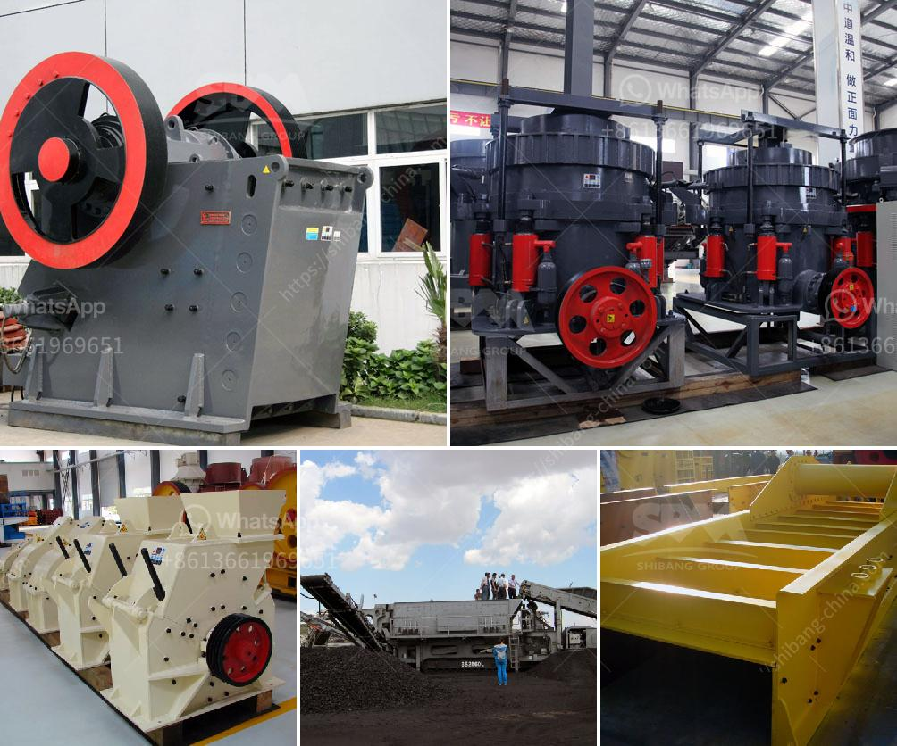

<h3>how much does a stone crusher mill</h3>
A stone crusher mill is a machine that crushes large stones into smaller ones. It is usually used for tertiary crushing, grinding, and pulverizing. The machine is popular for its versatility and efficiency in producing gravel and sand for construction projects. But how much does a stone crusher mill cost?

The cost of a stone crusher mill varies depending on several factors. One of the main factors is the type of machine used. Some machines are designed with a primary crushing stage, while others are solely for secondary crushing. The cost can also depend on the capacity of the machine, measured in tons per hour.

Other factors that affect the cost include the size and quality of the stones being crushed. If larger stones are needed, a more powerful machine may be required, resulting in increased costs. Additionally, the durability and reliability of the machine are important considerations that can affect the price.

On average, a stone crusher mill can cost anywhere between $50,000 to $200,000. However, it is important to note that this is just an estimate and the actual cost may vary depending on the specific requirements of the project.

Despite the initial investment, a stone crusher mill can bring long-term benefits to construction companies and contractors. The machine can produce high-quality materials that are essential for various construction purposes. It reduces the need for manual labor and increases efficiency, which can ultimately save money in the long run.

In conclusion, the cost of a stone crusher mill can range from $50,000 to $200,000 or more, depending on various factors such as the type and capacity of the machine. While it may seem like a significant investment upfront, the long-term benefits and savings make it a valuable asset for construction projects.
<h3>Contact us</h3><ul><li><strong>Whatsapp:&nbsp;<a href="https://wa.me/8613661969651">+8613661969651</a></strong></li><li><a href="https://swt.shibang-china.com/?git&amp;zhl&amp;how much does a stone crusher mill"><strong>Online Service(chat now)</strong></a></li></ul><h3>Related</h3><ul><li><a href='list iron ore crusher plants in india.md'>list iron ore crusher plants in india</a></li><li><a href='handmade rock crusher.md'>handmade rock crusher</a></li><li><a href='production of iron ore and manganese.md'>production of iron ore and manganese</a></li><li><a href='stone crusher machine price in bangladesh.md'>stone crusher machine price in bangladesh</a></li><li><a href='the cost of a clay brick making machine in south africa.md'>the cost of a clay brick making machine in south africa</a></li></ul>