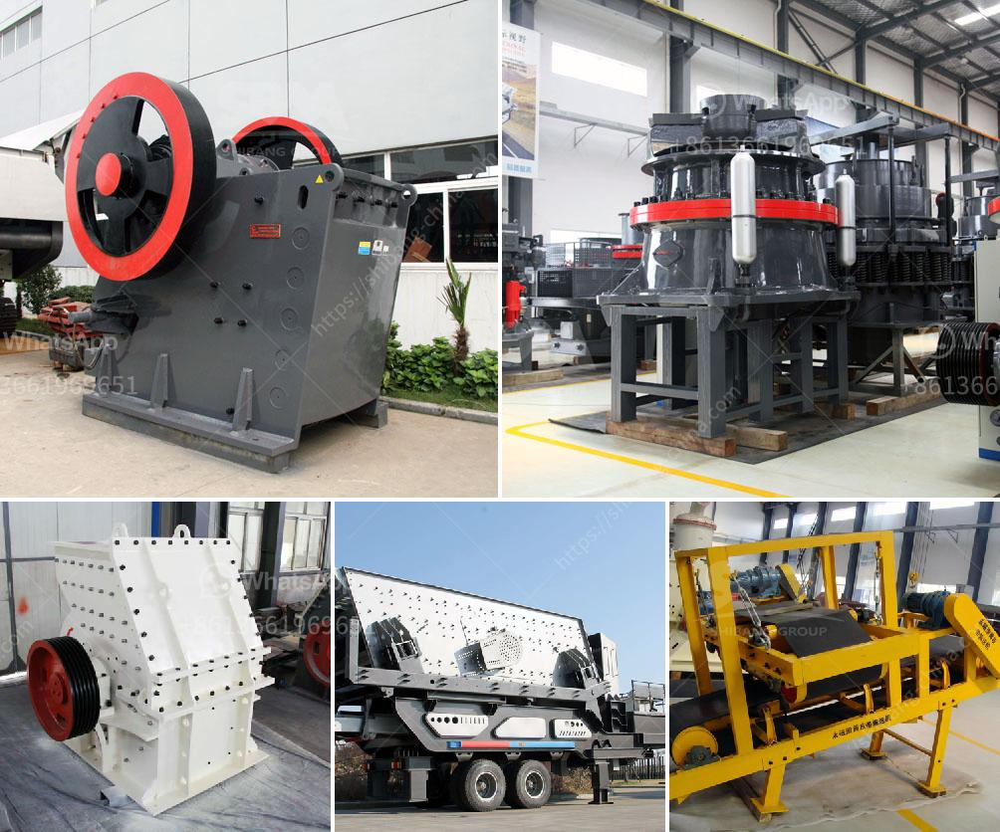

<h3>how much investment needed to start a crusher in canada</h3>
Starting a crusher in Canada requires significant capital investment. Certain factors need to be considered before venturing into this endeavor, as the initial cost of setting up a crusher can be high. However, the return on investment can be substantial, making it an attractive business opportunity for entrepreneurs in the construction and mining industries.

Firstly, it is essential to determine the purpose and capacity of the crusher. Crushers are primarily used to process raw materials for construction purposes or to crush large rocks into smaller stones for various applications. The capacity of the crusher, measured in tons per hour, will impact the initial investment.

The cost for acquiring the necessary equipment such as crushers, loaders, and trucks can range from hundreds of thousands to millions of dollars, depending on the scale of the operation. Additionally, expenses for the establishment of the necessary infrastructure, such as electricity, water supply, and proper waste management, should be taken into account.

Apart from the equipment and infrastructure costs, establishing a crusher requires obtaining the necessary permits and licenses from the regulatory authorities. It is crucial to comply with environmental regulations and obtain the necessary clearances from agencies responsible for protecting air and water quality, noise emissions, and other environmental concerns. These requirements may vary among different provinces and municipalities, contributing to the overall investment.

Moreover, a significant portion of the investment should be allocated for operational costs, including labor wages, maintenance and repair expenses, fuel, and raw material procurement. Adequate budgeting for these ongoing expenses will sustain the crusher's operations and contribute to its long-term success.

In conclusion, starting a crusher in Canada necessitates a significant investment. Entrepreneurs must carefully plan and budget for equipment acquisition, infrastructure development, licensing, and ongoing operational costs. However, with a well-executed business plan and effective management, the crusher can provide a lucrative opportunity for entrepreneurs in the construction and mining industries.
<h3>Contact us</h3><ul><li><strong>Whatsapp:&nbsp;<a href="https://wa.me/8613661969651">+8613661969651</a></strong></li><li><a href="https://swt.shibang-china.com/?git&amp;zhl&amp;how much investment needed to start a crusher in canada"><strong>Online Service(chat now)</strong></a></li></ul><h3>Related</h3><ul><li><a href='petroleum coke mill.md'>petroleum coke mill</a></li><li><a href='four roller mill.md'>four roller mill</a></li><li><a href='gypsum grinding machine.md'>gypsum grinding machine</a></li><li><a href='vibrating screen for sale philippines.md'>vibrating screen for sale philippines</a></li><li><a href='price of 500 tph stone crusher plant in malaysia.md'>price of 500 tph stone crusher plant in malaysia</a></li></ul>