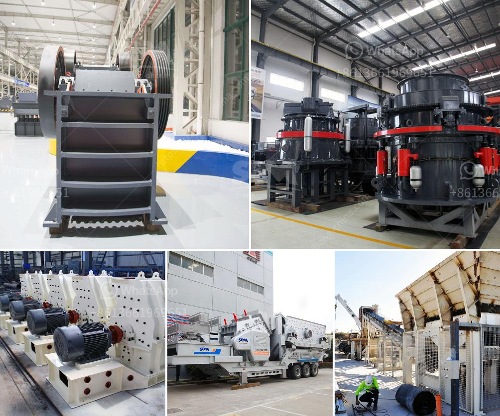

<h3>how much is the price of a jaw crusher</h3>
The price of a jaw crusher is determined by its size, capacity, and the materials that will be processed. The cost of a jaw crusher is also influenced by its geographical location, regional supply and demand, and market competition.

Jaw crushers are known for their ability to crush the toughest materials without hesitation. They can be used in a variety of applications, including rock quarries, sand and gravel, mining, construction, and demolition recycling. Their rugged design and versatility make jaw crushers highly sought after in the market.

When shopping for a jaw crusher, it's important to consider the following factors that can affect its price:

1. Size and capacity: Jaw crushers come in different sizes and capacities. Smaller machines are typically cheaper, while larger ones are more expensive. The size and capacity of the jaw crusher should be chosen based on the anticipated workload and the desired production output.

2. Material to be processed: Jaw crushers are designed to handle different types of materials, ranging from soft limestone to hard granite or basalt. The hardness and abrasiveness of the material can affect the wear and tear of the crusher components. High-quality jaw crushers with strong resistance to wear and corrosion are usually more expensive.

3. Geographical location: The region where the jaw crusher will be purchased can also influence its price. In some areas, the cost of equipment may be higher due to transportation and import/export costs. Additionally, local supply and demand dynamics can impact pricing.

4. Market competition: The number of suppliers and manufacturers of jaw crushers in the market can affect their prices. Increased competition can lead to lower prices, as suppliers try to attract customers by offering competitive rates. On the other hand, high demand and limited supply can drive prices up.

It is important to shop around and conduct thorough research before purchasing a jaw crusher. By obtaining quotes from multiple suppliers and comparing their prices and product specifications, buyers can make an informed decision.

The price range for jaw crushers can vary widely, starting from a few thousand dollars for a small, entry-level machine and going up to hundreds of thousands of dollars for high-capacity models with advanced features. Buyers should carefully assess their needs and budget before committing to a specific jaw crusher.

In conclusion, the price of a jaw crusher depends on its size, capacity, the materials to be processed, geographical location, and market competition. Buyers should consider these factors and conduct thorough research to find a jaw crusher that meets their requirements and budget.
<h3>Contact us</h3><ul><li><strong>Whatsapp:&nbsp;<a href="https://wa.me/8613661969651">+8613661969651</a></strong></li><li><a href="https://swt.shibang-china.com/?git&amp;zhl&amp;how much is the price of a jaw crusher"><strong>Online Service(chat now)</strong></a></li></ul><h3>Related</h3><ul><li><a href='ton day cement clinker grinding plant.md'>ton day cement clinker grinding plant</a></li><li><a href='gypsum board manufacturing.md'>gypsum board manufacturing</a></li><li><a href='hammer mill grinder thailand.md'>hammer mill grinder thailand</a></li><li><a href='coal powder mill.md'>coal powder mill</a></li><li><a href='crusher and screening equipment price in south africa.md'>crusher and screening equipment price in south africa</a></li></ul>