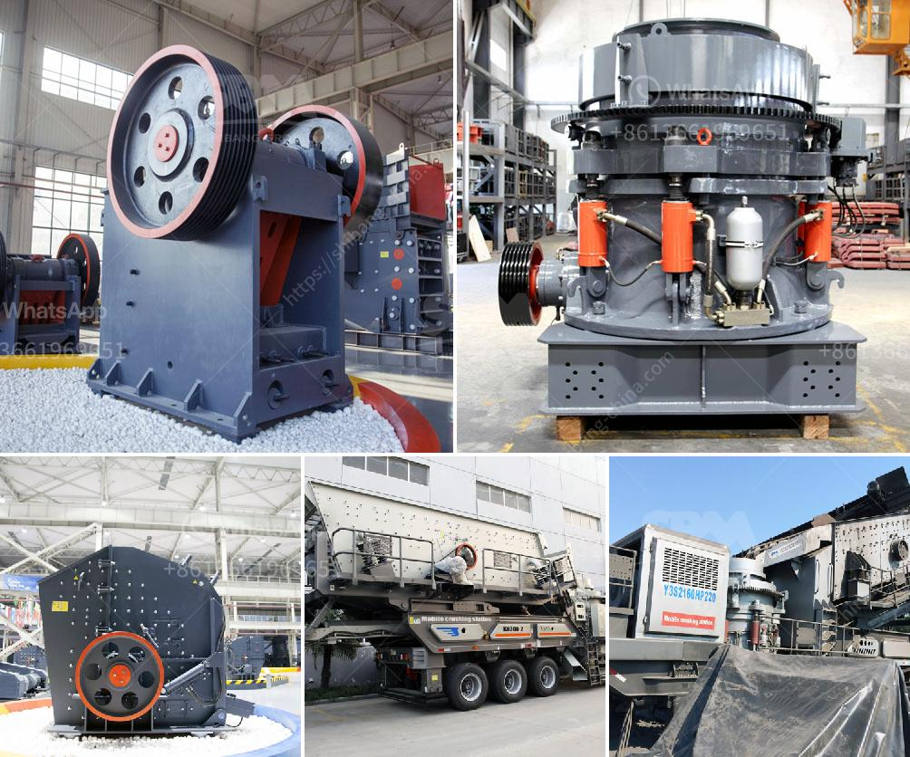

<h3>how much making limestone powder factory costs</h3>
Limestone powder, also known as limestone flour or limestone dust, is a by-product of limestone mining. When limestone is crushed into a fine powder, it can be used in various industrial applications such as cement manufacturing, iron and steel production, and agriculture to improve soil quality. As the demand for limestone powder grows, many entrepreneurs are considering establishing limestone powder factories. However, establishing such a factory involves various costs that need to be considered carefully.

The cost of establishing a limestone powder factory depends on several factors such as the location of the factory, the quality and size of the limestone deposit, the type of machinery and equipment required, the desired production capacity, and the regulatory requirements.

One of the significant costs in establishing a limestone powder factory is the acquisition of land. Since the factory requires a large area to store and process limestone, the cost of acquiring suitable land can be substantial. The location of the factory is crucial as it affects transportation costs, availability of limestone deposits, and access to skilled labor.

Another significant cost is the machinery and equipment required for the production process. This includes crushers, mills, sifters, and packaging machines. The cost of these machines depends on their capacity and quality. It is important to invest in reliable and efficient machinery to ensure smooth operations and minimize maintenance costs in the long run.

In addition to machinery, the factory will also need infrastructure such as storage facilities, workshops, administrative buildings, and utilities like water and electricity. Constructing these facilities involves construction costs, including material and labor costs.

Furthermore, it is crucial to consider the cost of acquiring the limestone deposit itself. The quality and size of the deposit determine the productivity and longevity of the factory. High-quality limestone may command a higher price and, therefore, increase the initial investment required.

Regulatory requirements and permits also impact the cost of establishing a limestone powder factory. Depending on the location and local regulations, various permits, licenses, and environmental impact assessments may be necessary. Complying with these requirements may involve additional costs, such as hiring consultants or conducting studies.

Lastly, ongoing costs such as labor, maintenance, and raw material supply must be taken into account. The number of employees required depends on the size and production capacity of the factory. Maintenance costs include regular inspections, repairs, and replacement of machinery and equipment. The availability and cost of raw materials, such as limestone, can also influence ongoing costs.

In conclusion, establishing a limestone powder factory involves significant costs. The acquisition of suitable land, machinery, equipment, infrastructure, and complying with regulatory requirements contribute to the overall investment. While the specific cost can vary depending on the factors mentioned above, it is crucial to conduct thorough research, feasibility studies, and financial planning before embarking on such an endeavor. Careful consideration of all costs involved is essential to ensure the long-term viability and success of the factory.
<h3>Contact us</h3><ul><li><strong>Whatsapp:&nbsp;<a href="https://wa.me/8613661969651">+8613661969651</a></strong></li><li><a href="https://swt.shibang-china.com/?git&amp;zhl&amp;how much making limestone powder factory costs"><strong>Online Service(chat now)</strong></a></li></ul><h3>Related</h3><ul><li><a href='ball mill problems and solutions.md'>ball mill problems and solutions</a></li><li><a href='hard rock crushers.md'>hard rock crushers</a></li><li><a href='grinder for milling price in india.md'>grinder for milling price in india</a></li><li><a href='estimated cost of building a steel mill.md'>estimated cost of building a steel mill</a></li><li><a href='crusher for crushing calcium carbonate.md'>crusher for crushing calcium carbonate</a></li></ul>