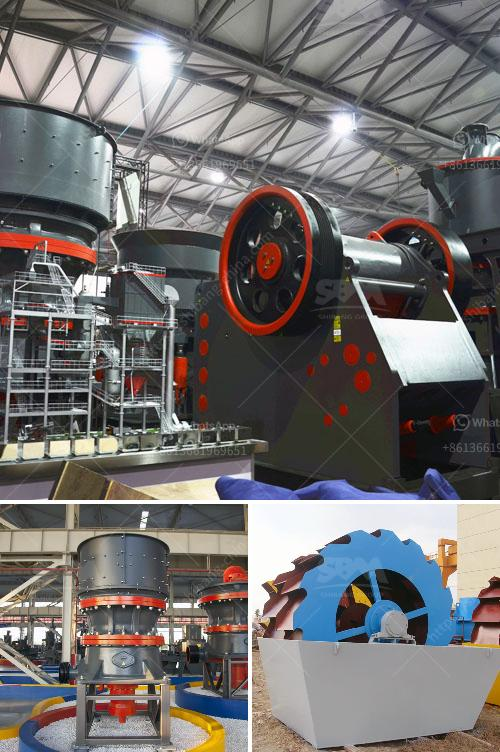

<h3>how much mini cement plant cost in india</h3>
A mini cement plant serves as a sustainable and profitable investment option for entrepreneurs who want to enter the cement manufacturing business. The cost of a mini cement plant in India varies depending on the type of plant you choose. The most common type of mini cement plants in India are rotary kiln plants and vertical shaft kiln plants.

A rotary kiln mini cement plant is a large-scale production line, containing a series of rotary kilns. These kilns are generally advanced and reliable technology with high efficiency and low energy consumption. The cost of a rotary kiln mini cement plant in India can range from about $3000 to $5000 per tonne of clinker produced.

Another type of mini cement plant is a vertical shaft kiln plant. This type of mini cement plant uses a vertical shaft kiln to produce clinker, which is then mixed with gypsum and ground into cement. The advantage of this type of plant is its vertical design, which requires less space and consumes less energy compared to a rotary kiln plant. The cost of a vertical shaft kiln mini cement plant in India can range from about $4000 to $7000 per tonne of clinker produced.

It is important to note that these cost estimates are approximate and can vary depending on numerous factors such as market conditions, location, machinery used, and raw material availability. It is recommended to conduct a detailed feasibility study and analyze the specific requirements of your project to get more accurate cost estimates.

In conclusion, setting up a mini cement plant can be a lucrative business opportunity in India. The cost of a mini cement plant varies depending on the type of plant and various other factors. Conducting a detailed feasibility study is crucial to determine the exact cost and requirements of your plant. With the right planning and execution, a mini cement plant can be a sustainable and profitable venture.
<h3>Contact us</h3><ul><li><strong>Whatsapp:&nbsp;<a href="https://wa.me/8613661969651">+8613661969651</a></strong></li><li><a href="https://swt.shibang-china.com/?git&amp;zhl&amp;how much mini cement plant cost in india"><strong>Online Service(chat now)</strong></a></li></ul><h3>Related</h3><ul><li><a href='cement plant machinery manufacturers in coimbatore.md'>cement plant machinery manufacturers in coimbatore</a></li><li><a href='ball mill in copper plant.md'>ball mill in copper plant</a></li><li><a href='mining equipment price in ghana.md'>mining equipment price in ghana</a></li><li><a href='prices of small gold processing machine.md'>prices of small gold processing machine</a></li><li><a href='mini sand stone crusher price.md'>mini sand stone crusher price</a></li></ul>