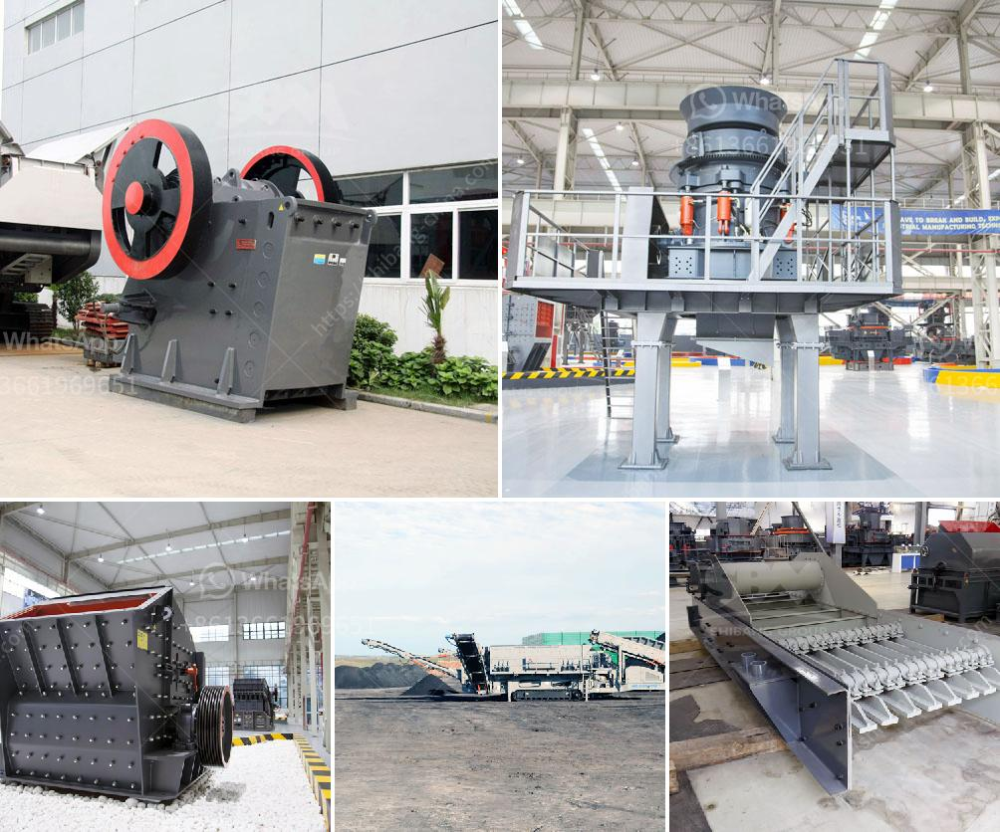

<h3>how to grind copper into powder</h3>
Copper is a versatile metal known for its excellent electrical conductivity and malleability, making it a valuable component in various applications, from electrical wiring to plumbing fixtures and industrial machinery. However, in certain industries or DIY projects, copper may be required in powder form to enhance its versatility and facilitate its use. Here, we will outline a step-by-step guide on how to grind copper into powder effectively.

Before starting the grinding process, it is crucial to gather all the required tools and equipment. This will ensure a smooth and efficient workflow. The essential items include safety goggles, a dust mask, a grinding mill, a mortar and pestle, or a mechanical grinder.

While grinding copper into powder, it is essential to prioritize safety. Put on safety goggles to protect your eyes and a dust mask to prevent inhaling any airborne particles. Grinding copper can create metal dust and splinters, so it is crucial to take appropriate measures to protect yourself.

Depending on the user's needs and the available equipment, copper can be ground into powder using various grinding methods. The most common methods include using a mechanical grinder, such as a ball mill or similar machinery, or utilizing a mortar and pestle.

If a mechanical grinder is available, it is an efficient and convenient method to grind copper into powder. Place the copper pieces or scraps into the grinder, along with a small amount of grinding material, such as steel balls or ceramic beads. Ensure that the grinder is securely closed to prevent any injuries or accidents.

Start the grinder and allow it to run for the required duration. The time required for grinding depends on the desired fineness of the copper powder. Periodically check the consistency of the powder by stopping the grinder and inspecting the contents. If the desired fineness is achieved, turn off the grinder, and carefully open it to retrieve the powdered copper. Be cautious when opening the grinder, as it may still contain sharp fragments.

In the absence of a mechanical grinder, a mortar and pestle can be used to grind copper into powder. Place the copper pieces or scraps into the mortar and use the pestle to crush them into a fine powder. This method is more time-consuming and physically demanding but efficient for small quantities of copper.

Once the copper is ground into powder, collect it carefully using a spoon or small scoop. Transfer the powdered copper to an airtight container or storage bag. Properly labeling the container will help identify its contents later and avoid confusion.

Grinding copper into powder may seem like a daunting task, but with the right tools and safety precautions, it can be accomplished successfully. Following this step-by-step guide will help you achieve the desired results efficiently. Remember to always prioritize safety by wearing protective gear and working in a well-ventilated area.
<h3>Contact us</h3><ul><li><strong>Whatsapp:&nbsp;<a href="https://wa.me/8613661969651">+8613661969651</a></strong></li><li><a href="https://swt.shibang-china.com/?git&amp;zhl&amp;how to grind copper into powder"><strong>Online Service(chat now)</strong></a></li></ul><h3>Related</h3><ul><li><a href='stone crusher machine price in pakistan.md'>stone crusher machine price in pakistan</a></li><li><a href='price of concrete crushing machine for sale.md'>price of concrete crushing machine for sale</a></li><li><a href='quartz mining machineries manufacturers.md'>quartz mining machineries manufacturers</a></li><li><a href='mineral that is used to make talcum powder.md'>mineral that is used to make talcum powder</a></li><li><a href='general layout of cement plant.md'>general layout of cement plant</a></li></ul>