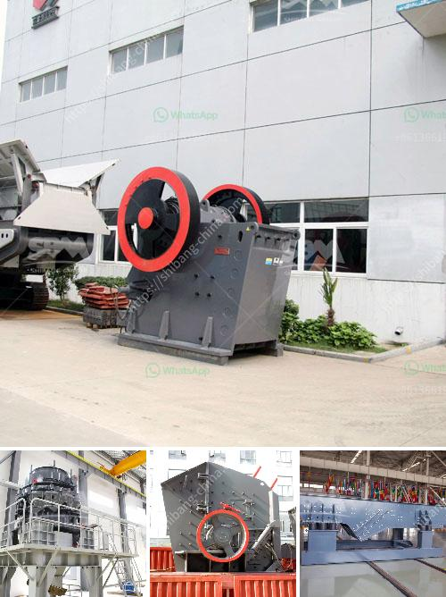

<h3>how to make talcum powder in the escapists</h3>
The Escapists is a popular video game where players take on the role of a prisoner trying to escape from various prisons. One essential item for every inmate is talcum powder. Talcum powder can be used for a variety of purposes in the game, including crafting various escape tools or trading with other inmates.

If you're wondering how to make talcum powder in The Escapists, this article will guide you through the process step by step. Keep in mind that crafting requires specific resources and tools, so it's important to be familiar with the in-game mechanics before attempting any recipes.

Firstly, take note of the components needed to create talcum powder: a tube of super glue and a roll of toilet paper. Without these items, you won't be able to produce talcum powder.

To obtain the tube of super glue, you can either find it in other prisoners' desks or purchase it from them. Alternatively, you may steal it from the prison's maintenance job location or from other locations where it might be present.

Finding toilet paper is relatively simple. It's commonly available in other prisoners' desks, prison bathrooms, or can be stolen from janitors pushing cleaning carts. Keep a lookout for these opportunities during your daily routines within the game.

Once you've obtained both the tube of super glue and the roll of toilet paper, navigate to the crafting menu by pressing the appropriate button on your platform. From there, locate the talcum powder recipe, which typically requires using a crafting table.

Select the talcum powder recipe, and if you have the necessary items in your inventory, a prompt will ask if you wish to craft it. Press the appropriate button to confirm, and voila! You've successfully created talcum powder.

Remember, with talcum powder in your possession, you have options to utilize it for various purposes within The Escapists. It can be combined with other components to create more advanced items like putty or a fake vent cover for your escape attempts.

Additionally, if trading is prominent in your gameplay, talcum powder is a valuable commodity. Inmates may be willing to trade items, favors, or even money for this versatile and essential material, so always be aware of potential trade opportunities.

In conclusion, crafting talcum powder in The Escapists is straightforward if you gather the necessary resources. Obtaining a tube of super glue and a roll of toilet paper will grant you this valuable item, useful for crafting escape tools or trading with fellow inmates. Remember to keep an eye out for opportunities to acquire these components, as well as other crafting materials, during your prison routine. Good luck with your escape plans!
<h3>Contact us</h3><ul><li><strong>Whatsapp:&nbsp;<a href="https://wa.me/8613661969651">+8613661969651</a></strong></li><li><a href="https://swt.shibang-china.com/?git&amp;zhl&amp;how to make talcum powder in the escapists"><strong>Online Service(chat now)</strong></a></li></ul><h3>Related</h3><ul><li><a href='ball india ball mills 220 tph.md'>ball india ball mills 220 tph</a></li><li><a href='graphite powder machine.md'>graphite powder machine</a></li><li><a href='used cement grinding mill for sale in uae.md'>used cement grinding mill for sale in uae</a></li><li><a href='horizontal grinding mills price.md'>horizontal grinding mills price</a></li><li><a href='roller mill for muradabad.md'>roller mill for muradabad</a></li></ul>