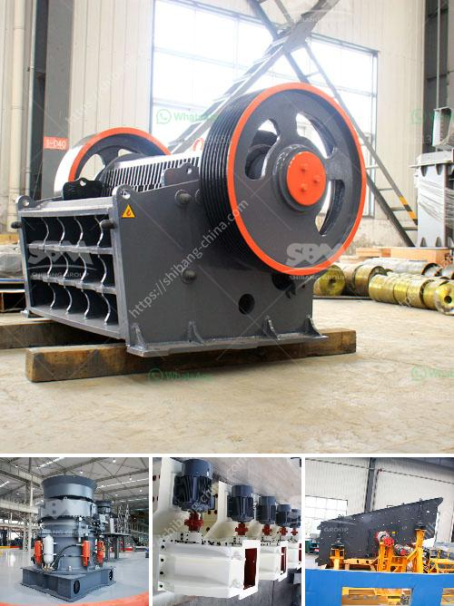

<h3>how to separate gold from sand with machine</h3>
If you live in a gold-rich area, the abundance of the precious metal might just be in the sands of your local river or creek. Similar to panning for gold, the process of separating the tiny grains of gold from the surrounding sand can be tedious and time-consuming. Luckily, there are some innovative machines specifically designed to process sand and help you recover gold more efficiently. In this article, we will explore the various methods and machines available to extract gold from sand.

One of the oldest methods used to separate gold from sand is gold panning. The ancient technique involves swirling water in a shallow pan, causing the heavy gold particles to sink to the bottom, while the lighter sand and gravel wash out from the pan. If you have access to a nearby river or creek, gold panning can be a cost-effective way to separate gold from sand, but it is labor-intensive, requiring patience, skill, and time to master.

For those who prefer a more automated approach, modern technology has introduced machinery designed specifically for gold recovery. One such machine is called a centrifugal concentrator. This equipment utilizes centrifugal force to separate the heavier gold particles from the surrounding sand and gravel. A spinning bowl attached to a motor rotates the material rapidly, causing the gold to settle and separate.

The centrifugal concentrator can process large amounts of gold-bearing sand and recover gold particles as small as 200 mesh (0.074mm). It works incredibly efficiently and can recover up to 90% of the fine gold particles. In addition to the centrifugal concentrator, other types of gravity separation machines include sluice boxes and jigging machines, all of which are capable of separating gold from sand.

Another popular method used to separate gold from sand involves using a shaking table. A shaking table uses gravity and water to separate the heavier gold particles from the sand and other material. The lighter particles are washed over the edge of the table and collected separately. A shaking table is an effective tool for separating gold from sand. It can recover fine gold particles as small as 0.020mm (800 mesh) with a recovery rate of 30-60%.

To maximize the success rate, it is imperative to properly feed the machine. It is essential to classify the sand in advance and remove any oversized material that may clog or deflect the flow of water. Depending on the machine, it is recommended to feed the sand at a consistent pace, allowing the gold particles to settle and accumulate in the designated area.

Furthermore, using the right amount of water is crucial. Too little water may cause the sand to move too quickly, resulting in gold particles being carried away. Conversely, too much water can suspend the gold particles, preventing them from settling and being captured by the machine.

Separating gold from sand can be a challenging endeavor, especially for individuals who are new to prospecting. Thankfully, innovative machines have been developed to simplify the process and increase efficiency. From centrifugal concentrators to shaking tables, each machine has its advantages and is suitable for different situations. By utilizing these technologies, anyone can increase their chances of successfully separating gold from sand and uncovering this precious metal.
<h3>Contact us</h3><ul><li><strong>Whatsapp:&nbsp;<a href="https://wa.me/8613661969651">+8613661969651</a></strong></li><li><a href="https://swt.shibang-china.com/?git&amp;zhl&amp;how to separate gold from sand with machine"><strong>Online Service(chat now)</strong></a></li></ul><h3>Related</h3><ul><li><a href='jaw crushers price.md'>jaw crushers price</a></li><li><a href='crushing stones for gold.md'>crushing stones for gold</a></li><li><a href='sand washing plants in india.md'>sand washing plants in india</a></li><li><a href='brick making business plan pdf.md'>brick making business plan pdf</a></li><li><a href='mobile coal screen units south africa.md'>mobile coal screen units south africa</a></li></ul>